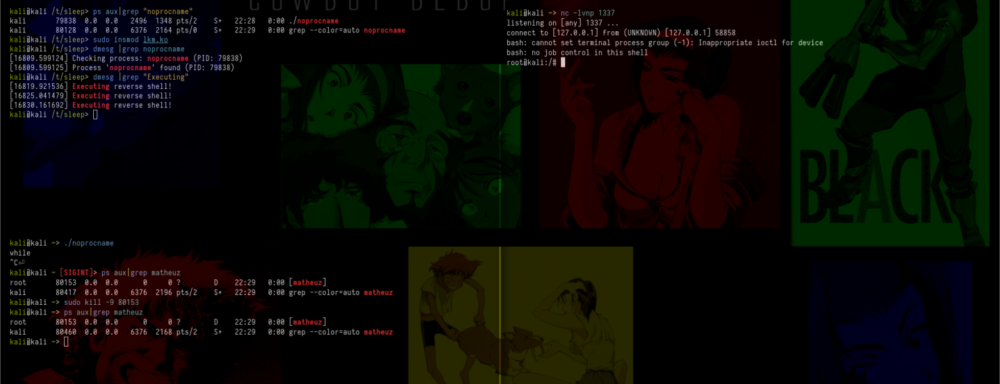

# **Persistent Reverse Shell with Kernel Thread Monitoring and Uninterruptible Sleep**

Have you ever seen a process with state (D) `Uninterrupted sleep`? If you've never seen this or don't know what it is, basically they are processes that cannot be stopped by `SIGKILL` they are practically immutable to this, that is, they cannot be terminated or manipulated easily until the expected resource is freed .

So, since it can't be stopped, why not use it in a “malicious” way? For example, creating an LKM that creates a `thread` to continuously monitor system processes and maintain a persistent reverse shell? That's what we're going to do!

Basically, this LKM creates a `thread` that periodically checks if the `noprocname` process is active. If it does not find `noprocname`, it executes a command to create a reverse shell. This reverse shell is kept active through a sleep set to 5 seconds. Executing the command to create the reverse shell is done through the `call_usermodehelper` function, which is used to execute a command in user space.

Of course, I used reverse shell just for an example, you can do other things with it, like run an ELF, run commands, etc.

In addition, you can come to `if (strncmp(task->comm, "noprocname", 10) == 0 && task->comm[10] == '\0') {`, and change it to another name too. (If you are going to change the name, remember that it needs to have the same number of chars, in this case noprocname has 10)

If you have any questions, please ask, if you learned, good learning and good studies xD
