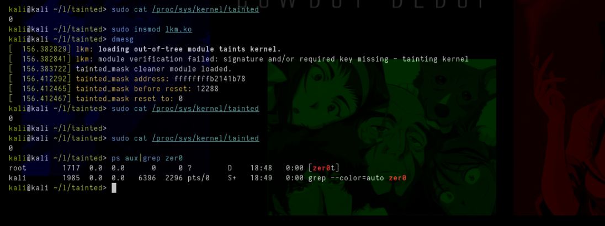

# **Resetting `/proc/sys/kernel/tainted`**

This code aims to periodically clear the kernel contamination mask. The taint mask is a variable that indicates whether the kernel has been modified by untrusted LKM (i.e., is not signed). A thread is created to run the `reset_taint_mask` function, which resets the taint mask to zero every 5 seconds, this is very good for the developer side of the LKM rootkit, because if you enter an LKM that has not been signed, the message normally appears in dmesg, and `/proc/sys/kernel/tainted`, has a number like `12228`, and checking this helps a lot in a forensic analysis, for example, resetting tainted makes your rootkit much more stealthy.

