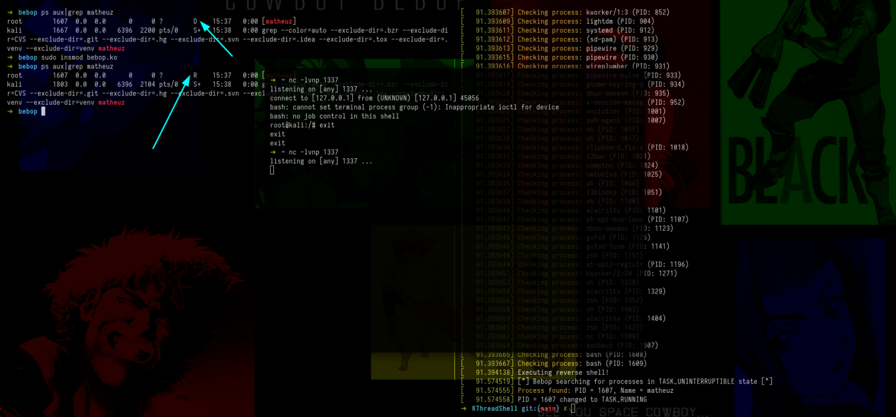

# Changing the execution of a thread in `state D (Uninterruptible Sleep) to R (Running)`

Hello guys, yesterday I was looking for some things out of curiosity, and one of them was: "how can I stop a persistence that uses thread and is in state D", and that's when I thought, if I change the state from D to R, persistence will no longer be executed, I used kthreadshell as an example.

basically we will identify all current processes and, when we find the first one in the `TASK_UNINTERRUPTIBLE` state, we change its state to `TASK_RUNNING` and "wake it up"

And why would this stop a type of persistence such as `KthreadShell` that uses a thread with state D (Uninterruptible Sleep)?
    
This happens because the reverse shell basically stops working when changing the process from `TASK_UNINTERRUPTIBLE (D)` to `TASK_RUNNING` because the process, when "woken up", is no longer blocked waiting for an I/O operation, interrupting which is necessary for the execution of revshell, which depends on this lock to function correctly.

