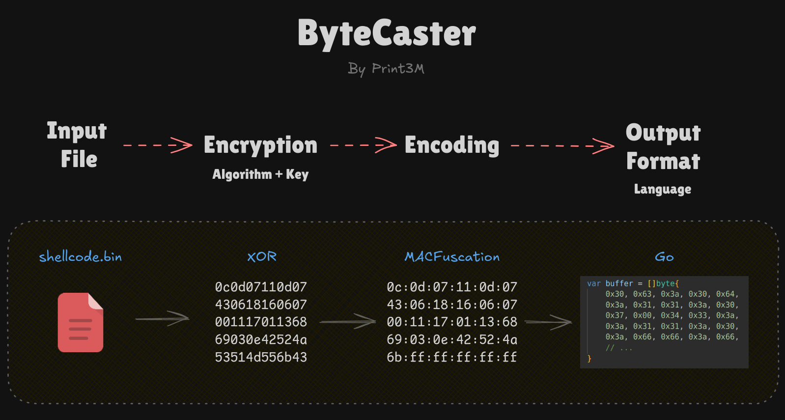
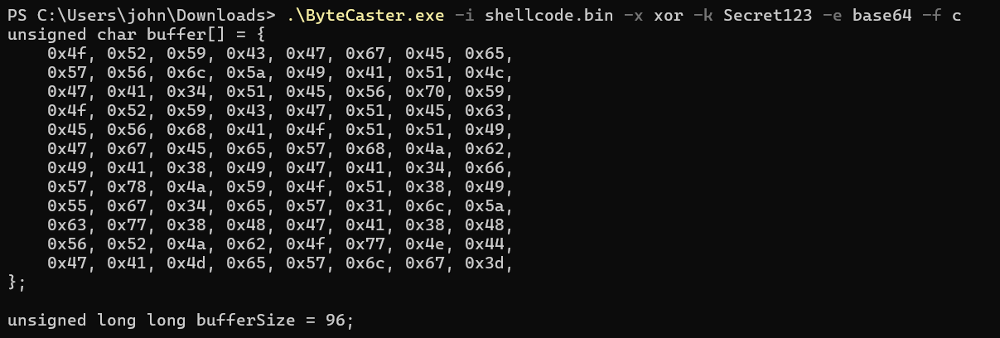

# ByteCaster

Swiss Army Knife for payload encryption, obfuscation, and conversion to byte arrays – all in a single command!

It supports 3 encryption algorithms, 4 encoding / obfuscation algorithms and 14 output formats.



## Installation

[Download the compiled binary](https://github.com/Print3M/ByteCaster/releases/tag/1.0.0) or compile Go source code.

## Usage

Example:

```bash
# Convert .bin file into C bytes array with XOR encryption and IPv4Fuscation
./ByteCaster -i shellcode.bin -f c -x xor -k 'Test123' -e ipv4

# Convert .bin file into base64 string with XOR encryption
./ByteCaster -i shellcode.bin -x xor -k 'Test123' -e base64
```



> **NOTE**: The sequence of operations is always the same:
>
> 1. Encryption
> 2. Encoding
> 3. Output formatting

**`-i / --input <path>`** [required]

Binary input file.

**`-f / --format <value>`** [optional, default: `raw`]

Output format of the processed data. This generates the final data as an array of bytes in the selected programming language. Output is always sent to STDOUT.

To avoid applying any formatting output, use the `raw` value (default).

Available values: `raw`, `hex`, `c`, `go`, `powershell`, `php`, `js`, `rust`, `csharp`, `nim`, `zig`, `ruby`, `python`, `java`

**`-x / --enc-alg <value>` + `-k / --enc-key <string>`** [optional]

Data encryption. Both parameters, the encryption algorithm and the key string, must be provided.

Availabe values: `xor`, `aes256`, `rc4`

All supported encryption algorithms are described in details below.

**`-e / --encoding <value>`** [optional]

Data encoding. Often used as obfuscation to confuse analysis or changes in the entropy level of data.

Available values: `base32`, `base64`, `ipv4`, `mac`

All supported encoding algorithms are described in details below.

## Supported encryption algorithms

#### **`xor`** [0% overhead]

Typical simple XOR encryption (`a^b`). Each byte is XORed with the byte from the key.

#### **`aes256`** [28 bytes overhead]

AES-256-GCM with the 32-bytes long key derived from SHA-256 hash function.

Ciphertext format: `nonce || ciphertext`. Nonce is stored in the first 12 bytes, followed by the encrypted data and authentication tag (the tag is appended automatically by GCM inside ciphertext).

Standard Go implementation of AES encryption:`crypto/aes`
Standard Go implementation of SHA-256 key derivation: `crypto/sha256`

#### **`rc4`** [0% overhead]

Standard Go implementation of RC4 encryption: `crypto/rc4`

## Supported encoding algorithms

#### **`base32`** [60–65% overhead]

Standard Go implementation of Base32 encoding: `encoding/base32`

#### **`base64`** [33%-37% overhead]

Standard Go implementation of Base64 encoding: `encoding/base64`

#### **`ipv4`** [100%-300% overhead]

This is known as the _IPv4Fuscation_ technique. Each output byte is converted to one octet in the IPv4 address as a decimal number.

Example data:

```text
{ 0xe9, 0x36, 0x17, 0xbb, 0xbd, 0x7f, 0x22, 0x10 }
```

The output (array of bytes) looks exactly like this in memory:

`233.54.23.187\0189.127.34.16\0` ...

> NOTE:
>
> - Each IP address ends with a null byte!
> - If the number of bytes is not divisible by 4, the missing bytes added to the last IP address are 255.

#### **`mac`** [200% overhead]

This is known as the _MACFuscation_ technique. Each output byte is converted to one octet in the MAC address as a hexadecimal number (lowercase).

Example data:

```text
{ 0xe9, 0x36, 0x17, 0xbb, 0xbd, 0x7f, 0x22, 0x10, 0x84, 0xA7, 0x6f, 0xcc }
```

The output (array of bytes) looks exactly like this in memory:

`e9:36:17:bb:bd:7f\022:10:84:a7:6f:cc\0`

> NOTE:
>
> - Each MAC address ends with a null byte!
> - Hexadecimal numbers are lowercase.
> - If the number of bytes is not divisible by 6, the missing bytes added to the last MAC address are 255 (`ff`).

## Credits

- [HellShell](https://github.com/NUL0x4C/HellShell) - inspired me to implement _IPv4Fuscation_ and _MACFuscation_.

## TODO

- Add base32 encoding
