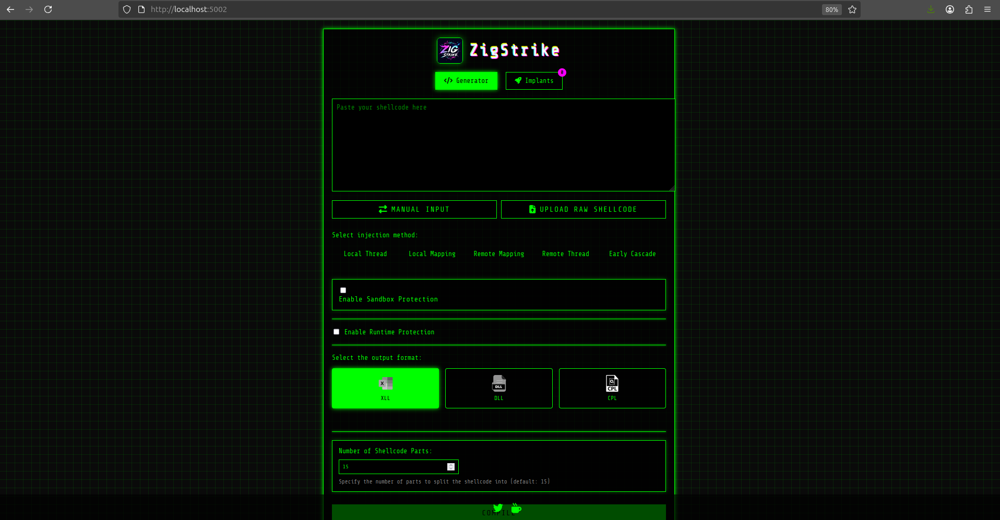

## ZigStrike

<p align="center">
  
</p>

##

ZigStrike is a robust shellcode loader developed in Zig, offering a variety of injection techniques and anti-sandbox features. It leverages compile-time capabilities for efficient shellcode allocation, demonstrating proven success in [bypassing advanced security solutions](https://kpmg.com/nl/en/home/insights/2024/12/zig-strike-the-ultimate-toolkit-for-payload-creation-and-evasion.html). ZigStrike includes a custom payload builder, allowing users to easily select and construct payloads via a web application built with Python.


### Features ( release 2.0 )

- **Multiple Injection Techniques**:
  - Local Thread 
  - Local Mapping
  - Remote Mapping
  - Remote Thread hijacking
  - EarlyCascade injection 

- **Anti-Sandbox Protection**:
  - TPM Presence Check.
  - Domain Join Check.
  - Run-Time protection.

- **Output Formats**:
  - XLL (Excel Add-in)
  - DLL
  - CPL

- **Advanced Features**:
  - Shellcode advanced allocation. 
  - Payload Runtime protection; preventing emulation and sandbox dynamic anaylsis.  
  - Bypass common detection rules.

* **Front-end enhancement**:
  - Added new page to view generated payloads. 
  - Detailed information for each created payload. 
  - Fix flask issue to support uploading large shellcode. 

## Runtime container

```bash
# Build the image
podman build -t zigstrike .

# Run the container
podman run -it --name zigstrike -p 5002:5002 -d zigstrike
```

### http://localhost:5002

<p align="center">
  
</p>

NOTE: Utilize CLRvoyance to view raw shellcode output to load into zigstrike.

##

```bash
# teardown
podman stop zigstrike

# other containers running in namespace
podman system prune -f

# blow it all away
podman system prune -a
```
