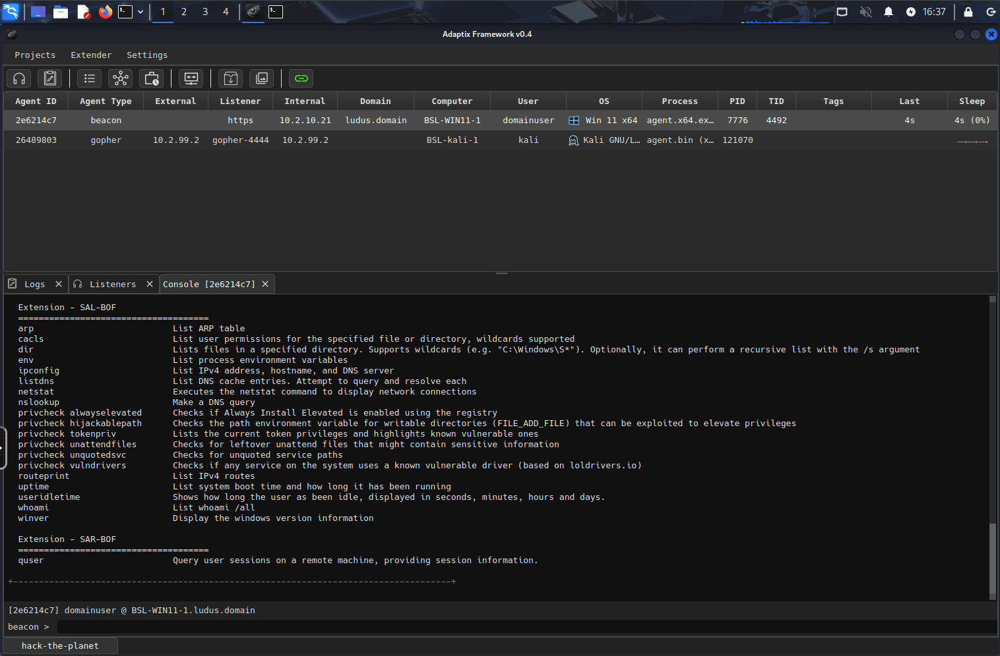

# Ansible Role: [Adaptix C2](https://adaptix-framework.gitbook.io/adaptix-framework) ([Ludus](https://ludus.cloud))

An Ansible Role that installs [Adaptix Framework](https://adaptix-framework.gitbook.io/adaptix-framework) server and/or client and all [Extensions](https://github.com/Adaptix-Framework/Extension-Kit) on a Debian based Linux host.



## Usage

By default the server listens on port `4321` and endpoint `/endpoint` with password `pass`. You can change these with role variables, see below.

On the client machine, run the command `adaptixclient` to start the GUI, and then log into the server using the settings above (unless changed via variables).

## Requirements

None.

## Role Variables

Available variables are listed below, along with default values (see `defaults/main.yml`):

    ludus_adaptix_c2_version: 56ced68c12be98f5086a7f3c62ecb39924061fd0 # 0.4 2024-04-28
    ludus_adaptix_c2_install_server: false # Set this or the one below to true or the role won't do anything!
    ludus_adaptix_c2_install_client: false
    ludus_adaptix_c2_profile_url:
    ludus_adaptix_c2_profile_raw:
    ludus_adaptix_c2_server_args: # -debug can be used here
    ludus_adaptix_c2_go_version: 1.24.3
    # All options below are for the Adaptix GUI clients to connect to the server, not a c2 agent
    ludus_adaptix_c2_port: 4321
    ludus_adaptix_c2_endpoint: /endpoint
    ludus_adaptix_c2_password: pass
    ludus_adaptix_c2_generate_certificate: true
    ludus_adaptix_c2_common_name: localhost
    ludus_adaptix_c2_organization_name: Adaptix C2
    ludus_adaptix_c2_subject_alt_name_array: "DNS:localhost,DNS:127.0.0.1,DNS:::1"

## Dependencies

None.

## Example Playbook

```yaml
- hosts: adaptix_server_host
  roles:
    - badsectorlabs.ludus_adaptix_c2
  vars:
    ludus_adaptix_c2_install_server: true

- hosts: adaptix_client_host
  roles:
    - badsectorlabs.ludus_adaptix_c2
  vars:
    ludus_adaptix_c2_install_client: true    
```

## Example Ludus Range Config

```yaml
ludus:
  - vm_name: "{{ range_id }}-adaptix-server"
    hostname: "{{ range_id }}-adaptix"
    template: debian-12-x64-server-template
    vlan: 99
    ip_last_octet: 1
    ram_gb: 4
    cpus: 2
    linux: true
    roles:
      - badsectorlabs.ludus_adaptix_c2
    role_vars:
      ludus_adaptix_c2_install_server: true

  - vm_name: "{{ range_id }}-kali-1"
    hostname: "{{ range_id }}-kali-1"
    template: kali-x64-desktop-template
    vlan: 99
    ip_last_octet: 2
    ram_gb: 4
    cpus: 2
    linux: true
    roles:
      - badsectorlabs.ludus_adaptix_c2
    role_vars:
      ludus_adaptix_c2_install_client: true
```

## Known issues

If building a Gopher agent fails with `JWT Error`, first try it again, if that still fails, SSH into the server and run the following commands:

```
# Assumes you are root to start
su adaptix -
cd /opt/adaptix/dist/extenders/agent_gopher/src_gopher
CGO_ENABLED=0 GOOS=linux GOARCH=amd64 go build -trimpath -ldflags="-s -w" -o agent -buildvcs=false && rm agent
CGO_ENABLED=0 GOOS=linux GOARCH=arm64 go build -trimpath -ldflags="-s -w" -o agent -buildvcs=false && rm agent
CGO_ENABLED=0 GOOS=darwin GOARCH=arm64 go build -trimpath -ldflags="-s -w" -o agent -buildvcs=false && rm agent
```

This will warm the go build cache so it can build within the 5 second timeout of the API. The role does this for you, but for some reason it doesn't work quite the same in ansible as via SSH?

## License

GPLv3

## Author Information

This role was created by [Bad Sector Labs](https://github.com/badsectorlabs), for [Ludus](https://ludus.cloud/).
