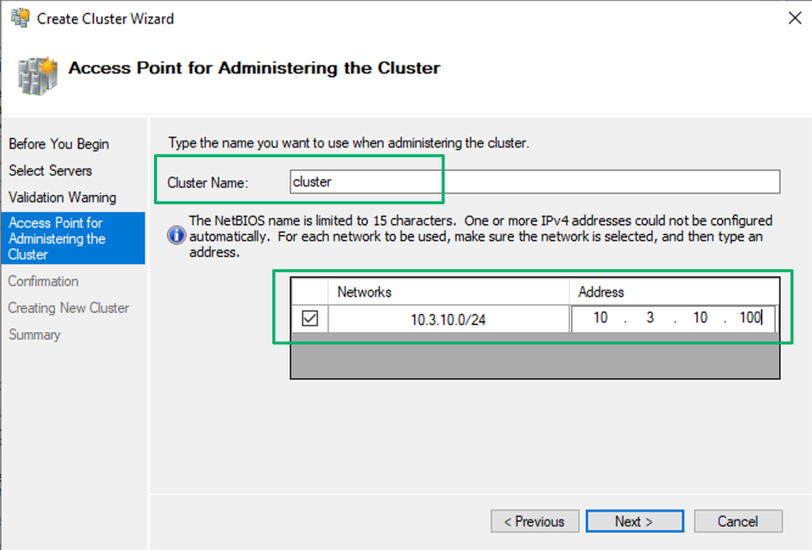
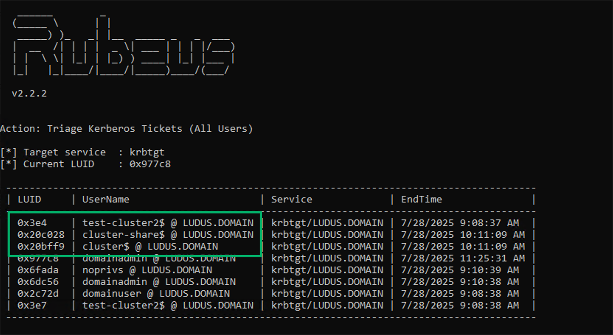
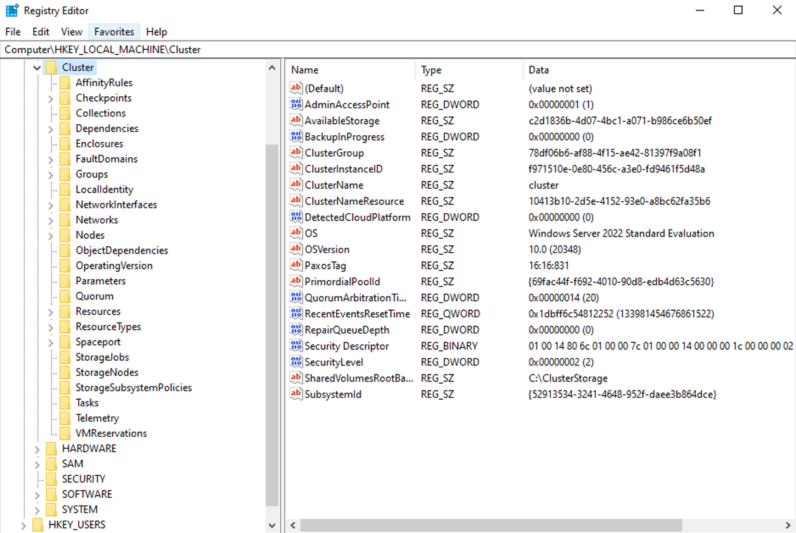
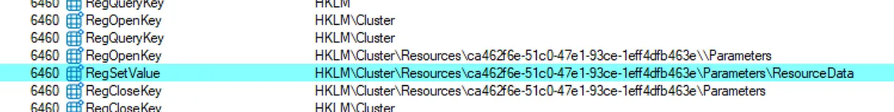
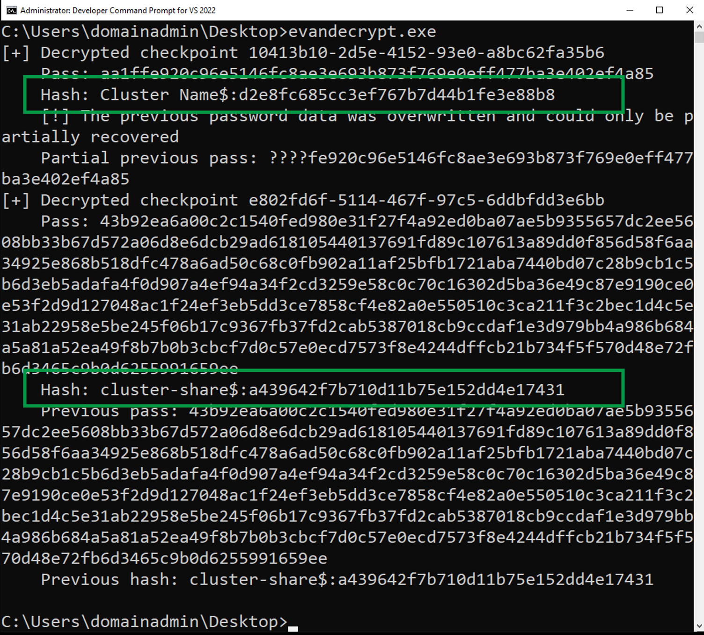

# Failover Fustercluck

## TL;DR

FusterCluck is a POC script for attacking failover clusters via the cluster API over RPC. The tool allows enumeration of cluster nodes and the state of cluster roles. If an attacker has control of a cluster admin or a cluster virtual account, they can migrate cluster groups to every node of the cluster and target the cluster namespaces as a method of lateral movement.


## Installation


```
pip install -r requirements.txt
```

## Commands


- `enum_cluster [type]` - Enumerate cluster resources (node, group, resource, network)
- `get_clustername` - Get cluster and node names
- `get_groupstate <group_name>` - Get current state of a cluster group
- `movegroup -group <name> -node <name>` - Move a group to a specific node
- `help` - Show available commands
- `exit` - Terminate the session

## Examples

```
# Enumerate all nodes in the cluster
enum_cluster node

# Enumerate all groups in the cluster
enum_cluster group

# Check state of a cluster group
get_groupstate "cluster-share"

# Move a group to a different node
movegroup -group "cluster-sharer" -node "NODE1"
```

# Attacking WSFC

## Introduction

Windows Server Failover Cluster (WSFC) is a Microsoft Windows feature that grants high availibility to resources or applications. Examples of clustered services include distributed file servers or MSSQL databases. Always-On Availability Groups (AG) are built on-top of WSFC services and provide alternate methods of high availability depending on the admin's needs. Standard deployments of WSFC create Active Directory machine accounts to represent cluster resources. These are known as the cluster name object (CNO) and virtual computer objects (VCO) and are commonly referred to as "cluster virtual accounts". 

## Cluster Virtual Accounts

The CNO is created when the cluster is deployed and represents the cluster itself while the VCO represents a clustered service or application and is created when the role is deployed on the cluster.  A cluster may only have one CNO but may have one or more VCOs depending on the number of roles installed. For clarity, not all roles require use of a VCO and admins may choose to forego deployment such as for a MSSQL AG. When each account is created, an IP address is reserved in DHCP and a DNS entry is created that represents an access point. The 



These access points, or namespaces, enable access to cluster resources. The CNO namespace provides an administrative access point and is how the cluster is managed while the VCO namespace provides standard access and is how clients interact with the the clustered role(s).  

## Cluster Nodes

A cluster will have two or member servers known as nodes. Nodes work collaboritiavely to ensure availability and own or host the CNO and VCO resources. Only one node may own the resource at a time and is considered the active node. When a client requests access to a clustered resource the active client facilitates the request. In the event of a failure, the cluster automatically moves the role's group of dependent resources to the next healthy node. When the cluster service starts on a node, the service validates the credentials for the VCO and CNO accounts and maintains a persistent logon session for each to facilitate failover and minimize downtime.



## Cluster Database

Cluster configuration settings are stored in registry and replicated to each node in the cluster at `HKLM\Cluster`. When a setting is updated in the cluster, each node updates their own database to ensure settings are synchronized and passive nodes are able to assume an active state in the event of a failover.



To facilitate Kerberos authentication, each node must be able to decrypt service tickets provided by clients for the cluster namespaces. The cluster stores and replicates encrypted credentials for the CNO and VCO AD machine accounts in the `ResourceData` key for each resource in the cluster database.



An administrative user may decrypt and recover the hashed credentials for these accounts using the POC code provided [here](https://gist.github.com/EvanMcBroom/a63f17466c7d1ab8b11ae80e520287ce).





## S4U2Self

With control of the virtual account credentials, an attacker may use the S4U2Self Kerberos extension to impersonate cluster admins in combination with this tool to commpromise the cluster.

