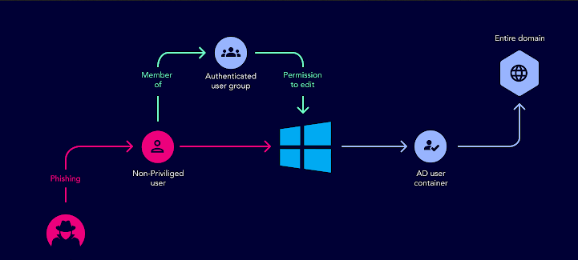
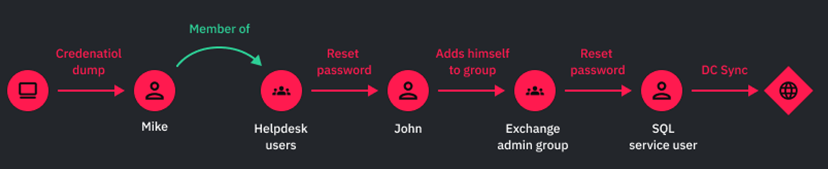
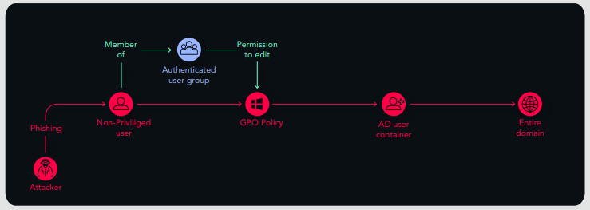
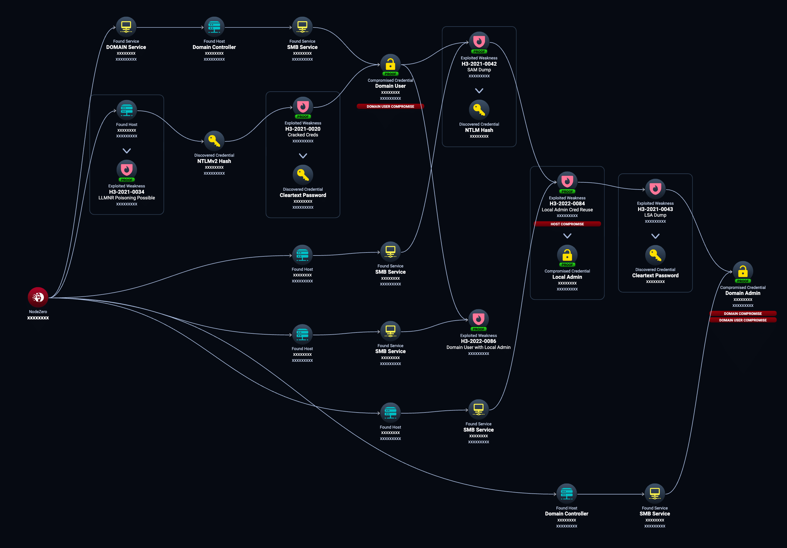
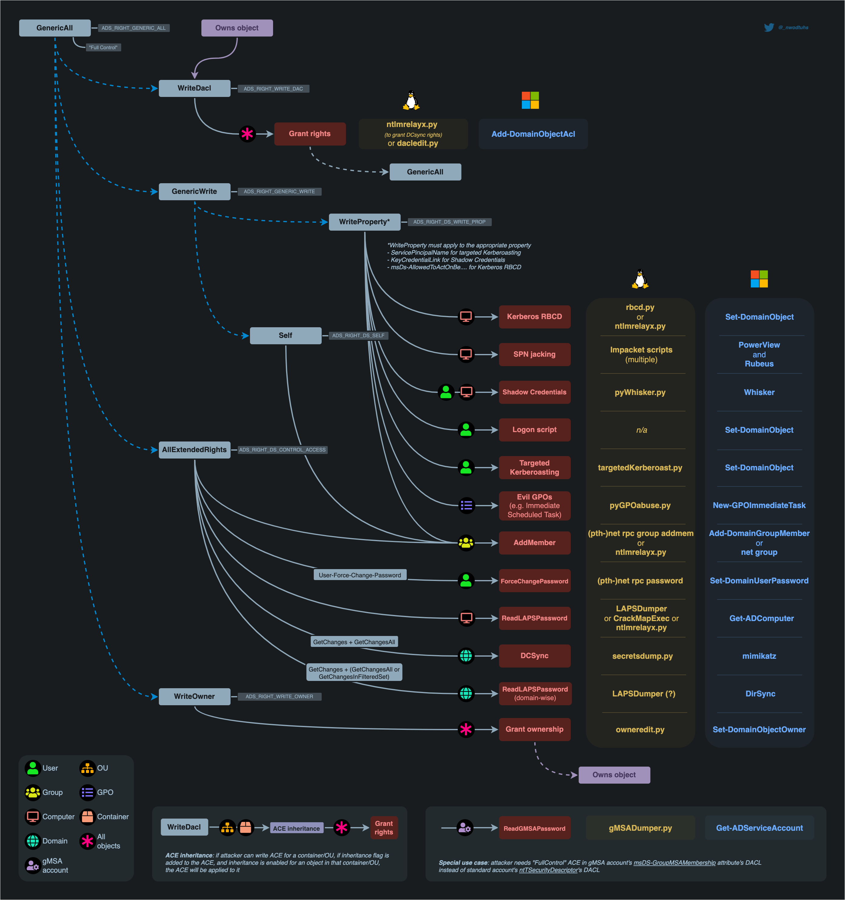

## AD Attacks

Active Directory attack paths generally involve three key stages: Initial Access, Discovery & Enumeration, and Privilege Escalation & Domain Dominance. Attackers initially gain entry, then explore the network to identify vulnerabilities, and finally escalate privileges to gain control over the domain.

1. Initial Access:

Attackers gain an initial foothold in the environment, often through techniques like:

        Phishing emails:

          Compromising user credentials through malicious emails.

        Stolen VPN credentials:

          Gaining access through compromised VPN accounts.

        Unsecured Remote Desktop connections:

          Exploiting exposed RDP connections.

        Exploiting vulnerabilities in AD-integrated applications:

          Targeting weaknesses in applications that rely on AD.

        Compromising user accounts:

          Through password attacks like password spraying or brute-force attacks.

2. Discovery & Enumeration:

Once inside, attackers begin mapping the network and identifying potential targets. This involves:

        LDAP queries:

          Using LDAP to gather information about users, groups, and domain structure.

        Standard Windows commands:

          Utilizing commands like net user /domain to enumerate users and their permissions.

        Identifying sensitive accounts:

          Targeting privileged accounts like domain admins.

        Reconnaissance at each stage:

          Attackers continuously gather information as they move through the network, adapting their approach based on discovered vulnerabilities.

3. Privilege Escalation & Domain Dominance:

This stage focuses on gaining elevated privileges to control the domain:

        Kerberoasting:

          Exploiting Kerberos to obtain password hashes of service accounts.

        Pass-the-hash:

          Using stolen password hashes to authenticate and access resources.

        Golden Ticket attacks:

          Creating forged Kerberos tickets to gain domain-wide access.

        DCSync attacks:

          Replicating Active Directory data to extract credentials.

        Abusing AdminSDHolder:

          Exploiting the AdminSDHolder object to propagate permissions.

        Unconstrained delegation:

          Gaining the ability to impersonate any user to any service.

        NTDS.dit extraction:

          Stealing the Active Directory database file to extract password hashes.

        Creating backdoors:

          Establishing persistent access to the domain for long-term control.

4. Exfiltration and Cleanup:

    After achieving domain dominance, attackers may exfiltrate sensitive data and attempt to cover their tracks.

## Visuals

Attacking Users:

  

  

Attacking Groups

  

Attacking Service Accounts:

  

Attacking Contain Objects (Domains, OUs) / Attacking Group Policies and GPLinks

  

## Methods and Flows:

  

  

