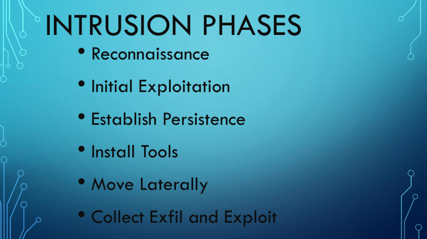
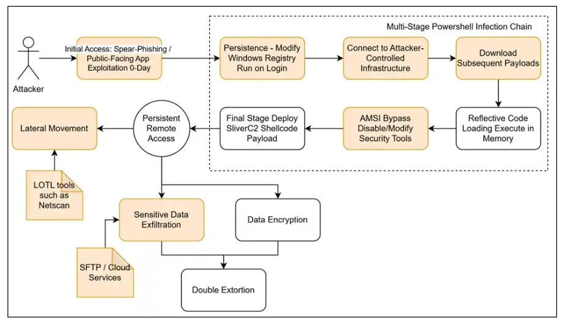

## TTP's

  

### Tactics = The why (the objective)

The high-level description of the behavior and strategy of a threat actor. The tactic includes a set of behaviors and actions employed by the adversary to achieve a specific objective.

    Reconnaissance

    Delivery and exploitation

    Acting on the objectives

    The initial entry point(s)

    Compromised nodes or credentials

### Techniques = The how (general method used).

These are the non-specific guidelines and intermediate methods that describe how a tactic action can be realized.

    Infiltrate a network.

    Establish command and control centers.

    Move laterally within the network without trace.

    Spread malware infection across distributed network locations.

    Establish control for untraceable infrastructure modifications and data transfers.

### Procedures = The specific (exact sequence of actions)

These refer to the sequence of actions performed using a technique to execute on an attack tactic. The procedure involves detailed descriptions on the tailored activities that enable a threat actor to successfully achieve their targets.

### Example of Current Day Attack Path TTP's
##

  

