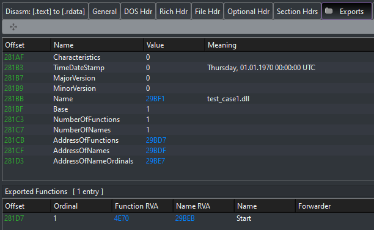

# EXE_to_DLL

Converts an EXE, so that it can be loaded like a DLL.<br/>
<b>Supports both 32 and 64 bit DLLs</b>

***Inspired by the idea of [@guywhataguy](https://github.com/guywhataguy/). Read more [here](https://blog.vastart.dev/2020/04/calling-arbitrary-functions-in-exes.html).***

## Usage

Compile:

```bash
podman build -t exe-to-dll -f compile.Dockerfile
podman run -it --name exe-to-dll -d exe-to-dll
podman cp exe-to-dll:/_bin .
podman stop exe-to-dll
podman system prune -a
```

Run `exe_to_dll` from commandline. Arguments:

```
args: <input_exe> <output_dll>
```

Example:

```
exe_to_dll.exe test_case1.exe test_case1.dll
```

After the successful conversion you should obtain a DLL exporting a `Start` function. This is the Original Entry Point of your input application.



You can test it by running:

```
rundll32.exe test_case1.dll,Start
```
