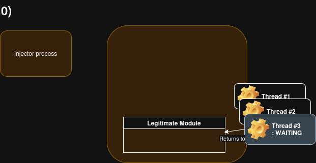

# Waiting Thread Hijacking demo

Waiting Thread Hijacking - injection by overwriting the return address of a waiting thread.

**Details: https://research.checkpoint.com/2025/waiting-thread-hijacking/**

### Demo

https://www.youtube.com/watch?v=CZIR4gq4jQ0
